```mermaid
graph TD
    A[클라이언트] --> B{POST /api/v1/users/login};
    B --> C[백엔드: 요청 수신];
    C --> D{요청 바디 유효성 검증};
    D -- 실패 (400 Bad Request) --> E[응답: 에러 메시지];
    D -- 성공 --> F[DB에서 Email 기준 사용자 정보 조회];
    F --> G{사용자 존재 여부 및 비밀번호 일치 확인};
    G -- 사용자 없음/비밀번호 불일치 (401 Unauthorized) --> E;
    G -- 일치 --> H[JWT Access Token & Refresh Token 생성];
    H --> I[응답: 200 OK, AccessToken, RefreshToken, 사용자 기본 정보];
    I --> A;
    E --> A;
```

```mermaid
graph TD
    A[클라이언트] --> B{GET /api/v1/users/me Authorization 헤더에 AccessToken 포함};
    B --> C[백엔드: 요청 수신];
    C --> D{Authorization 헤더를 통한 AccessToken 존재 여부 확인};
    D -- 없음 (401 Unauthorized) --> E[응답: 에러 메시지];
    D -- 있음 --> F{서명, 만료 시간을 통한 AccessToken 유효성 검증};
    F -- 유효하지 않음/만료 (401 Unauthorized) --> E;
    F -- 유효함 --> G[토큰에서 사용자 ID 추출];
    G --> H[DB에서 ID 기준 사용자 정보 조회];
    H --> I{사용자 존재 여부};
    I -- 없음 (404 Not Found) --> E;
    I -- 있음 --> J[Authorization를 통한 요청된 자원에 대한 사용자 권한 확인 인가];
    J -- 권한 없음 (403 Forbidden) --> E;
    J -- 권한 있음 --> K[사용자 정보 응답 데이터 구성];
    K --> L[응답: 200 OK, 사용자 상세 정보];
    L --> A;
    E --> A;
```

<!--more-->
v0.1

## 📂 목차

- [핵심 기능 도출](#핵심-기능-도출)
    - [최소 기능 정의](#최소-기능-정의)
    - [User Flow 설계](#user-flow-설계)
        - [UF Registration](#uf-registration)

- [요구사항 정의(Requirement Specification)](#요구사항-정의)
    - [핵심 기능에 대한 요구 수집](#핵심-기능에-대한-요구-수집)
        - [RQ Registration](#rq-registration)

    - [시나리오/유스케이스 작성](#시나리오유스케이스-작성)
        - [SC Registration](#sc-registration)

- [기획 협업(생략)](#기획-협업)
- [기술 설계(Design Specification)](#기술-설계)
    - [API 스펙 초안 작성](#api-스펙-초안-작성)
        - [API Registration](#api-registration)

    - [DB 테이블/엔티티 구조 정의](#db-테이블엔티티-구조-정의)
    
    - [서비스 계층의 로직 흐름 정리](#서비스-계층의-로직-흐름-정리)
        - [SD Registration](#sd-registration)

- [개발 Sprint](#개발-sprint)
    - [핵심 기능 우선순위 설정 및 분할](#핵심-기능-우선순위-설정-및-분할)
    - [TDD 기반 소스코드 작성](#tdd-작성)

- [Sprint Review & Retrospective](#sprint-review--retrospective)
    - [v0.1](#v01)

---

## 📚 본문

User 관련 기능을 RESTful 하게 구현하고 재사용하기 위해 User Component 혹은 패키지를 구현한다. 필요에 따라 서브 프로세스는 생략한다.

### 핵심 기능 도출

대부분의 서비스에 대한 User 관리 기능을 총체적으로 관리하는 컴포넌트를 개발하기 위해 핵심 기능을 도출한다.

#### 최소 기능 정의

서비스가 존재할 수 있는 가장 작은 단위를 다음 기능을 포함하는 서비스로 정의

1. 회원가입 (Registration)

- 목표: 새로운 사용자가 서비스에 계정을 생성하고 접속 가능
- 핵심 기능:
    - 사용자로부터 이메일 주소, 비밀번호, 사용자 이름을 입력
    - 이메일 주소의 **유일성** 및 **유효성**을 검증
    - 비밀번호는 보안을 위해 **해싱하여 저장**
    - 성공적으로 계정이 생성되면 사용자에게 **확인 응답**

<!--
2. 로그인 (Login)
- 목표: 기존 사용자가 본인 인증을 통해 서비스에 접근하고, 보호된 리소스에 대한 접근 권한을 획득하는 것으로 정의
- 핵심 기능:
    - 사용자로부터 이메일 주소와 비밀번호를 입력
    - 입력된 비밀번호를 해싱된 저장된 비밀번호와 비교하여 일치 여부를 확인
    - 인증 성공 시, 이후 API 요청에 사용될 인증 토큰 (예: JWT - `Access Token`, `Refresh Token`)을 발급하여 반환
    - 인증 실패 시, 적절한 오류 메시지를 반환

3. 인증 (Authentication)
- 목표: 로그인한 사용자가 '누구인지' 즉, 사용자의 신원을 검증
- 핵심 기능:
    - 로그인 시 발급된 인증 토큰(예: `Access Token`)을 사용하여, 이후 모든 보호된 API 요청에서 사용자의 신원을 확인
    - 토큰의 유효성 (만료 여부, 변조 여부 등)을 검증하여 유효한 사용자만이 API를 호출 가능

4. 인가 (Authorization)
- 목표: 인증된 사용자가 '무엇을 할 수 있는지' 결정하고, 특정 리소스 또는 기능에 대한 접근 권한을 부여/제한
- 핵심 기능:
    - 인증된 사용자의 역할 또는 권한을 기반으로 특정 API 엔드포인트나 데이터에 대한 접근 허용 여부를 판단

5. 탈퇴 (Deactivation/Deletion)
- 목표: 사용자가 서비스에서 자신의 계정을 영구적으로 삭제 가능
- 핵심 기능:
    - 탈퇴를 요청한 사용자의 인증 토큰을 통해 신원을 확인
    - 사용자의 계정 정보 및 관련 데이터를 삭제 가능
    - 성공적으로 처리되면 사용자에게 확인 응답

-->

#### User Flow 설계

##### UF Registration

```mermaid
graph TD
    A[클라이언트] --> B{POST /api/v1-beta/users/register};
    B --> C[백엔드: 요청 수신];
    C --> D{요청 바디 유효성 검증};
    D -- 실패 (400 Bad Request) --> E[응답: 에러 메시지];
    D -- 성공 --> F{이메일 중복 확인};
    F -- 중복 (409 Conflict) --> E;
    F -- 고유함 --> G[비밀번호 해싱];
    G --> H[사용자 정보 DB 저장];
    H --> I{DB 저장 성공?};
    I -- 실패 (500 Internal Server Error) --> E;
    I -- 성공 --> J[응답: 201 Created, 생성된 사용자 ID/Email];
    J --> A;
    E --> A;
```

##### Login

##### Authentication & Authorization

##### Deletion

```mermaid
graph TD
    A[클라이언트] --> B{DELETE /api/v1/users/me Authorization 헤더에 AccessToken 포함};
    B --> C[백엔드: 요청 수신];
    C --> D{AccessToken 유효성 검증 및 사용자 ID 추출};
    D -- 실패 (401 Unauthorized) --> E[응답: 에러 메시지];
    D -- 성공 --> F[DB에서 해당 사용자 정보 조회 및 삭제/비활성화];
    F --> G{DB 처리 성공?};
    G -- 실패 (500 Internal Server Error) --> E;
    G -- 성공 --> H[연관된 세션/토큰 무효화];
    H --> I[응답: 204 No Content 또는 200 OK];
    I --> A;
    E --> A;
```

### 요구사항 정의

앞서 다뤘던 MVP 와 User Flow Chart 를 통한 기능에 대한 구체적인 요구사항을 수집한다. 개발자들이 기능을 구현할 때 참고할 수 있는 구체적인 설계 가이드라인이 되기에 상세히 작성할수록 좋다.

#### 핵심 기능에 대한 요구 수집

##### RQ Registration
새로운 사용자가 서비스에 계정을 생성

- API 엔드포인트: `POST /api/v1/users/register`
- 요청 (Request Body): JSON 형식
    - `email` (문자열, 필수): 사용자의 이메일 주소
        - 제약사항: 유효한 이메일 형식 (예: `user@example.com`).
        - 제약사항: 시스템 내에서 고유해야 함
        - 길이 제한: 최대 255자
    
    - `password` (문자열, 필수): 사용자가 설정할 비밀번호
        - 제약사항: 최소 8자 이상, 대문자/소문자/숫자/특수문자 중 3가지 이상 포함
        - 길이 제한: 최소 8자, 최대 64자

    - `username` (문자열, 필수): 사용자 이름 (닉네임)
        - 제약사항: 중복 허용 (필요에 따라 고유성 제약 추가 가능)
        - 길이 제한: 최소 2자, 최대 30자

- 성공 응답 (`Response - 201 Created`): JSON 형식
    - `id` (정수/UUID): 생성된 사용자의 고유 ID
    - `email` (문자열): 등록된 이메일 주소
    - `username` (문자열): 등록된 사용자 이름
    - `message` (문자열): "회원가입이 성공적으로 완료되었습니다."

- 오류 응답 (Response): JSON 형식
    - `status` (정수):
        - `400 Bad Request` (유효성 검증 실패)
        - `409 Conflict` (이메일 중복)
        - `500 Internal Server Error` (서버 내부 오류)

    - `code` (문자열): 특정 오류를 식별하는 내부 코드
        - `INVALID_EMAIL_FORMAT`
        - `PASSWORD_POLICY_VIOLATION`
        - `EMAIL_ALREADY_EXISTS`

    - `message` (문자열): 사용자에게 표시할 오류 메시지
        - "이메일 형식이 올바르지 않습니다."
        - "비밀번호는 최소 8자 이상, 64자 이하이며, 영문 대소문자, 숫자, 특수문자 중 3가지 이상을 포함해야 합니다."
        - "이름은 최소 2자 이상이며, 최대 30자 입니다."
        - "이미 등록된 이메일 주소입니다."
        - "서버 오류가 발생했습니다. 사용자 정보를 저장하는 데 실패했습니다. 잠시 후 다시 시도해 주세요."

- 백엔드 처리 로직:
    - 요청 데이터 유효성 검증
    - 이메일 중복 확인
    - 비밀번호 해싱 (예: bcrypt)
    - 사용자 정보를 데이터베이스에 저장

> (선택 사항) 회원가입 시점에 기본 역할(Role) 부여 (예: USER)

<!--

##### Login
등록된 사용자가 인증 토큰을 발급받아 보호된 리소스에 접근 가능

- API 엔드포인트: `POST /api/v1/users/login`
- 요청 (Request Body): JSON 형식
    - `email` (문자열, 필수): 사용자의 이메일 주소
    - `password` (문자열, 필수): 사용자의 비밀번호

- 성공 응답 (`Response - 200 OK`): JSON 형식
    - `accessToken` (문자열): 보호된 API 호출에 사용될 JWT (JSON Web Token)
        - 유효 기간: 15분 ~ 1시간 (보안 정책에 따라 상이)
    
    - `refreshToken` (문자열, 선택 사항): Access Token 만료 시 갱신에 사용될 토큰 (MVP에서는 선택적으로 포함, 보안 강화 목적)
        - 유효 기간: 7일 ~ 30일.
    
    - `user` (객체):
        - `id` (정수/UUID): 사용자 고유 ID
        - `email` (문자열): 사용자 이메일
        - `username` (문자열): 사용자 이름

    - `message` (문자열):
        - "로그인 성공."

- 오류 응답 (Response): JSON 형식
    - `status` (정수):
        - `400 Bad Request` (필수 필드 누락)
        - `401 Unauthorized` (인증 실패)
    
    - `code` (문자열): 특정 오류를 식별하는 내부 코드
        - `INVALID_CREDENTIALS`
        - `USER_NOT_FOUND`

    - `message` (문자열): "이메일 또는 비밀번호가 올바르지 않습니다."

- 백엔드 처리 로직:
    - 요청 데이터 유효성 검증
    - 데이터베이스에서 이메일로 사용자 조회
    - 조회된 사용자의 해싱된 비밀번호와 입력된 비밀번호 비교
    - 비밀번호 일치 시, JWT `accessToken` 및 `refreshToken` (선택 사항) 생성
    - `refreshToken` 사용 시, 데이터베이스에 `refreshToken` 저장 (보안을 위해 해싱 또는 암호화하여)

##### Email Exists Check (`GET /api/v1/users/check`)

회원가입 과정에서 입력한 이메일이 이미 등록된 계정인지 확인하는 데 사용합니다.

- API 엔드포인트: `GET /api/v1/users/check?email=someone@example.com`

- 요청 파라미터:
    - `email` (문자열): 확인할 이메일 주소

- 성공 응답 (`200 OK`):
    - `exists` (boolean): 해당 이메일이 이미 존재하면 `true`, 존재하지 않으면 `false`

- 오류 응답 (`400 Bad Request` 등):
    - 이메일 형식이 올바르지 않거나 누락되었을 때 적절한 에러 메시지 반환

- 백엔드 처리 로직:
    - 이메일 유효성 검증
    - DB에서 이메일 기준 사용자 존재 여부 확인
    - 결과를 Boolean 형식으로 응답

##### Deletion

로그인된 사용자가 자신의 계정을 삭제 가능

- API 엔드포인트: `DELETE /api/v1/users/me`
- 요청 헤더 (Request Header):
    - Authorization: Bearer <AccessToken>

- 성공 응답 (Response - `204 No Content` 또는 `200 OK`):
    - `status` (정수): HTTP 상태 코드
        - `204 No Content` (권장): 성공적으로 처리되었으나 응답 본문이 없을 때
        - `200 OK` (선택 사항): 메시지 포함 시
    - `message` (문자열):
        - "계정이 성공적으로 탈퇴 처리되었습니다."

- 오류 응답 (Response): JSON 형식
    - `status` (정수):
        - `401 Unauthorized`
        - `404 Not Found`
        - `500 Internal Server Error`
    - `code` (문자열): 오류 코드
        - `UNAUTHORIZED_ACCESS`
        - `USER_NOT_FOUND`
    - `message` (문자열):
        - "인증 정보가 없습니다."
        - "사용자를 찾을 수 없습니다."

- 백엔드 처리 로직:
    - Authorization 헤더에서 Access Token 추출 및 유효성 검증
    - 유효한 토큰에서 사용자 ID 추출
    - 해당 사용자 ID의 데이터베이스 레코드를 실제 삭제하거나, `is_active`와 같은 플래그를 false로 설정하여 논리적으로 비활성화 (서비스 정책에 따라 결정)
    - 연관된 모든 유효한 Refresh Token 및 세션 정보를 무효화하여 해당 계정으로 더 이상 로그인할 수 없도록 합니다.

##### Authentication & Authorization

요청을 보내는 클라이언트(사용자)의 **신원(Authentication)**을 검증하여 '누구인지'를 확인합니다.

인증된 사용자가 요청된 리소스 또는 기능에 접근할 **권한(Authorization)**이 있는지 확인하여 '무엇을 할 수 있는지'를 결정합니다.

모든 인증 및 인가 단계를 성공적으로 통과하면, 요청된 원래 API의 비즈니스 로직이 계속해서 수행됩니다.

- API 엔드포인트: 이 기능 자체는 독립적인 엔드포인트가 아니며, `GET /api/v1/users/me`, `PUT /api/v1/users/me`, `DELETE /api/v1/users/me` 등 모든 보호된 API 요청에 적용되는 공통 로직입니다.

- 요청 헤더 (Request Header):
    - Authorization: Bearer <AccessToken> (클라이언트가 로그인 시 발급받은 유효한 Access Token을 이 헤더에 포함하여 전송해야 합니다.)

- 요청 (Request Body): (없음 - 인증/인가 자체는 요청 바디를 필요로 하지 않습니다.)

- 성공 응답(Response - `200 OK`): HTTP 상태 코드
    - `status` (정수):
        - `200 OK` (원래 API 요청의 성공 응답에 따라 결정됨. 인증/인가 로직 자체는 별도의 200 OK를 반환하지 않음)

- 오류 응답 (Response): JSON 형식

    - `status` (정수): HTTP 상태 코드
        - `401 Unauthorized` (Authorization 헤더가 없거나 토큰이 제공되지 않았을 때, 제공된 Access Token이 유효하지 않거나 변조되었을 때, Access Token의 유효 기간이 만료되었을 때)

        - `403 Forbidden` (AccessToken은 유효하고 사용자도 존재하지만, 해당 사용자가 요청된 특정 리소스나 작업에 대한 접근 권한이 없을 때 (예: 일반 사용자가 관리자만 접근 가능한 리소스에 접근하려 할 때))

        - `404 Not Found` (AccessToken은 유효하지만, 토큰에서 추출된 사용자 ID에 해당하는 사용자를 데이터베이스에서 찾을 수 없을 때 (예: 계정이 이미 삭제되었으나 만료되지 않은 토큰으로 요청했을 경우))
        
        - `500 Internal Server Error` (서버 내부에서 토큰 검증, 사용자 조회, 권한 확인 등 인증/인가 처리 중 예기치 않은 오류가 발생했을 때)

    - `code` (문자열): 특정 오류를 식별하는 내부 코드
        - `NO_TOKEN_PROVIDED`
        - `INVALID_TOKEN`
        - `EXPIRED_TOKEN`
        - `USER_NOT_FOUND`
        - `FORBIDDEN_ACCESS`
        - `AUTHENTICATION_FAILED` (일반적인 인증 실패)
        - `AUTHORIZATION_FAILED` (일반적인 인가 실패)

    - `message` (문자열): 사용자에게 표시할 명확한 오류 메시지
        - "인증 토큰이 제공되지 않았습니다."
        - "유효하지 않은 인증 토큰입니다."
        -"토큰이 만료되었습니다. 다시 로그인해주세요."
        - "요청하신 사용자를 찾을 수 없습니다."
        - "이 리소스에 접근할 권한이 없습니다."
        - "인증 처리 중 오류가 발생했습니다."

- 백엔드 처리 로직:
    - AccessToken 존재 및 형식 확인:
        - 수신된 HTTP 요청의 Authorization 헤더를 검사하여 Bearer <AccessToken> 형식을 따르는지 확인합니다.
        - Authorization 헤더가 없거나 형식이 올바르지 않으면 `401 Unauthorized` 응답을 반환합니다.
    - AccessToken 유효성 검증 (Authentication):
        - JWT 라이브러리 등을 사용하여 AccessToken의 **서명(Signature)**이 유효하고, 만료되지 않았으며(Expiration Time), 발급자(Issuer) 등 기타 클레임이 유효한지 검증합니다.
        - 검증 실패 시 `401 Unauthorized` 응답을 반환합니다.
    - 사용자 식별 및 존재 확인:
        - 유효한 AccessToken의 페이로드에서 사용자의 고유 ID를 추출합니다.
        - 추출된 사용자 ID를 사용하여 데이터베이스에서 해당 사용자가 실제로 활성화 상태로 존재하는지 조회합니다.
        - 사용자가 존재하지 않으면 `404 Not Found` 응답을 반환합니다.
    - 권한 확인 (Authorization):
        - 인증된 사용자의 역할(Role)이나 권한(Permission) 정보를 기반으로, 요청된 API 엔드포인트(`GET /api/v1/users/me`의 경우 본인 정보 조회)에 대한 접근 권한이 있는지 판단합니다.
        - 권한이 없는 경우 `403 Forbidden` 응답을 반환합니다.
    - 다음 로직으로 전달:
        - 모든 인증 및 인가 단계를 성공적으로 통과하면, 요청을 보낸 사용자의 ID 및 권한 정보를 다음 비즈니스 로직(예: 사용자 정보 조회, 수정, 탈퇴 등)으로 안전하게 전달하여 해당 로직이 정상적으로 수행되도록 합니다.

-->

#### 시나리오/유스케이스 작성

작성하기 전 유스케이스 다이어그램

```mermaid
graph LR
    Actor(사용자) --> UC1(회원가입);
```

##### SC Registration

**공통 전처리**
- 요청 바디에서 `email`, `password`, `username`을 추출한다.
- 각 필드에 대해 유효성 검증을 수행한다.
    - `email`: 문자열 여부 및 이메일 형식 검증
    - `password`: 길이 및 보안 정책(대소문자, 숫자, 특수문자 포함) 검증
    - `username`: 최소/최대 길이 확인

**성공 흐름**
1. 이메일이 중복인지 확인한다.
2. 비밀번호를 해싱 처리한다.
3. 해싱된 비밀번호와 함께 사용자 정보를 DB에 저장한다.
4. 저장이 성공하면 다음 정보를 포함한 `201 Created` 응답을 반환한다.
    - `id`: 생성된 사용자 ID
    - `email`: 등록된 이메일 주소
    - `username`: 등록된 사용자명
    - `message`: "회원가입이 성공적으로 완료되었습니다."

**실패 흐름 입력 무효**
1. 검증에 실패한 경우 `400 Bad Request` 응답과 함께 적절한 오류 메시지를 반환한다.
    - "이메일 형식이 올바르지 않습니다."
    - "비밀번호는 최소 8자 이상, 64자 이하이며, 영문 대소문자, 숫자, 특수문자 중 3가지 이상을 포함해야 합니다."
    - "이름은 최소 2자 이상이며, 최대 30자 입니다."

**실패 흐름 이메일 중복**
3. 이메일이 중복인지 확인한다.
4. 이메일이 중복인 경우 `409 Conflict` 응답과 함께 적절한 오류 메시지를 반환한다.
    - "이미 등록된 이메일 주소입니다."

**실패 흐름 DB 서버 통신 실패**
1. 이메일이 중복인지 확인한다.
2. 비밀번호를 해싱 처리한다.
3. 해싱된 비밀번호와 함께 사용자 정보를 DB에 저장한다.
4. DB에 반영되지 않은 경우 `500 Internal Server Error` 와 함께 적절한 오류 메시지를 반환한다.
    - "서버 오류가 발생했습니다. 사용자 정보를 저장하는 데 실패했습니다. 잠시 후 다시 시도해 주세요."

### 기술 설계

#### API 스펙 초안 작성

##### API Registration

새로운 사용자가 서비스에 가입하기 위해 필요한 정보를 제출하는 API입니다.

- HTTP Method: `POST`
- URL: `/api/v1-beta/users/register`

**요청 바디 (Request Body)**

| 필드명 | 데이터 타입 | 설명 |
|:---:|:---:|:---|
| `email` | string | 사용자 이메일 주소 |
| `password` | string | 사용자 비밀번호 |
| `username` | string | 사용자 이름 |

> 요청 바디 예시

{
  "email": "user@example.com",
  "password": "Password123!",
  "username": "홍길동"
}


**응답 (Response)**

| 상태 | 코드 | 설명 |
|:---:|:---:|:---|
| `201` | `Created` | 회원가입이 성공적으로 완료되었을 때 반환하는 응답 |
| `400` | `Bad Request` | 요청 바디의 유효성 검증에 실패했을 때 반환하는 응답 |
| `409` | `Conflict` | 이메일이 이미 사용 중이어서 회원가입이 불가능할 때 반환하는 응답 |
| `500` | `Internal Server Error` | 서버 내부에서 예기치 않은 오류가 발생했을 때 반환하는 응답 |

> 응답 바디 예시 헤더는 생략:

{
  "id": "uuid-1234-5678-90ab",
  "email": "user@example.com",
  "username": "홍길동",
  "message": "회원가입이 성공적으로 완료되었습니다."
}
{
  "error": "비밀번호는 최소 8자 이상, 64자 이하이며, 영문 대소문자, 숫자, 특수문자 중 3가지 이상을 포함해야 합니다."
}
{
  "error": "이미 등록된 이메일 주소입니다."
}
{
  "error": "서버 오류가 발생했습니다. 잠시 후 다시 시도해 주세요."
}


#### DB 테이블/엔티티 구조 정의

```mermaid
erDiagram
    users {
        UUID id PK "사용자 고유 ID"
        VARCHAR email "이메일 주소"
        VARCHAR password "해싱된 비밀번호"
        VARCHAR username "사용자 이름"
    }
```

#### 서비스 계층의 로직 흐름 정리

##### SD Registration

```mermaid
sequenceDiagram
    participant User as 사용자
    participant Client as 클라이언트(웹/앱)
    participant APIServer as API 서버
    participant Service as 서비스 계층
    participant Database as 데이터베이스

    Title: 사용자 회원가입 시퀀스 다이어그램

    %% 성공 흐름
    User->>Client: 회원가입 정보 입력
    Client->>APIServer: 회원가입 요청<br/>(POST /api/v1-beta/users/register)

    APIServer->>Service: 요청 처리 위임
    Service->>Service: 1. 유효성 검증<br/>(email, password, username)
    Service->>Database: 2. 이메일 중복 확인
    Database-->>Service: 중복 없음

    Service->>Service: 3. 비밀번호 해싱
    Service->>Database: 4. 사용자 정보 저장
    Database-->>Service: 저장 성공

    Service-->>APIServer: 201 Created 응답 반환
    APIServer-->>Client: 201 Created 응답
    Client-->>User: "회원가입 성공" 메시지 표시

    %% 입력 무효 실패 흐름
    alt 입력 무효
        User->>Client: 잘못된 정보 입력
        Client->>APIServer: 회원가입 요청<br/>(POST /api/v1-beta/users/register)
        APIServer->>Service: 요청 처리 위임
        Service->>Service: 1. 유효성 검증<br/>(실패)
        Service-->>APIServer: 400 Bad Request 반환
        APIServer-->>Client: 400 Bad Request 응답
        Client-->>User: "잘못된 입력입니다" 메시지 표시
    end

    %% 이메일 중복 실패 흐름
    alt 이메일 중복
        User->>Client: 중복 이메일 입력
        Client->>APIServer: 회원가입 요청<br/>(POST //api/v1-beta/users/register)
        APIServer->>Service: 요청 처리 위임
        Service->>Service: 1. 유효성 검증<br/>(성공)
        Service->>Database: 2. 이메일 중복 확인
        Database-->>Service: 중복된 이메일 존재
        Service-->>APIServer: 409 Conflict 반환
        APIServer-->>Client: 409 Conflict 응답
        Client-->>User: "이미 등록된 이메일입니다" 메시지 표시
    end
```

### 개발 Sprint

여기서는 구현하기 전 사용할 공통 라이브러리들을 전부 불러오고, 서버의 구동 profile 에 맞춰 configuration 들을 미리 작성해준다.

#### 핵심 기능 우선순위 설정 및 분할

빈 class 파일들을 생성하고 Data Access, Presentation, Business Logic Layer 을 중점으로 작성해준다.

0. 엔드포인트(`UserController`) 구현 (`/api/v1-beta/users`)

1. register(`POST /api/v1-beta/users/register`)
    1. User Entity 구현
    2. 비즈니스 엔티티 유효성 검증을 위한 커스텀 인터페이스들 정의
        - `@Password`
        - `@Email` - `jakarta.validation.constraints` 참고
    3. 비즈니스 엔티티 유효성 검증을 위한 빈 밸리데이터 정의
        - `PasswordRuleValidator` 클래스 구현
    4. User JPA 변환 및 DAO 클래스(`UserRepository`) 구현
        - 이메일 중복 검증을 위한 `existsByEmail` 함수 정의
        - 유저 데이터 저장하는 `createUser` 함수 정의
    5. User 관련 최종 서비스를 제공하는 클래스(`UserService`) 구현
        - `register` 함수 구현
    6. `UserController`의 `register` 함수 구현

#### TDD 기반 소스코드 작성

위의 class diagram을 바탕으로 Test class 들을 작성해주어야 한다.


@DataJpaTest
@ActiveProfiles("test")
class UserRepositoryTest {

    @Autowired
    UserRepository userRepository;

    @BeforeEach
    void setup() {
        userRepository.save(
                new User("1@email.com", "name", "1234!@")
        );
    }

    @AfterEach
    void init() {
        userRepository.deleteAll();
    }

    @ParameterizedTest
    @CsvSource({"1@gmail.com, name, 1234!@"})
    void givenTheData_whenCreatingSameUser_thenThrowsException(String email, String username, String password) {
        User user = new User(email, username, password);

        assertThrows(
                DataIntegrityViolationException.class,
                () -> userRepository.save(user)
        );
    }

    @ParameterizedTest
    @CsvSource({"user@email.com, user, 12329212@@!hdH"})
    void givenCreatedUser_whenExistingUser_thenExpectedResult(String email, String username, String password) {
        userRepository.save(new User(email, username, password));

        assertTrue(userRepository.existsByEmail(email));
        assertTrue(userRepository.existsByEmail("1@email.com"));
    }
}



@SpringBootTest
@ActiveProfiles("test")
public class UserServiceTest {
    @Autowired
    private UserService userService;

    private static final BCryptPasswordEncoder PASSWORD_ENCODER = new BCryptPasswordEncoder();

    // AI 생성 테스트케이스
    // --- 테스트 데이터 제공 메서드 ---
    // @MethodSource 가 참조하는 정적 메서드입니다.
    // 각 Arguments 는 User 객체와 예상 결과를 담고 있습니다.
    private static Stream<Arguments> wrongUserTestCases() {
        return Stream.of(
                // 이메일 형식이 유효하지 않은 경우
                Arguments.of("invalid_email.com", "user", "Valid-Password-123!",
                        "이메일 형식이 올바르지 않습니다."),

                // 사용자 이름이 너무 짧은 경우 (최소 2자)
                Arguments.of("valid@email.com", "a", "Valid-Password-123!",
                        "이름은 최소 2자 이상이며, 최대 30자 입니다."),

                // 비밀번호가 너무 짧은 경우 (최소 8자)
                Arguments.of("valid@email.com", "user", "short1!",
                        "비밀번호는 최소 8자 이상, 64자 이하이며, 영문 대소문자, 숫자, 특수문자 중 3가지 이상을 포함해야 합니다."),

                // 비밀번호가 복잡성 조건을 만족하지 못하는 경우 (3가지 이상 포함)
                Arguments.of("valid@email.com", "user", "lowercaseonly",
                        "비밀번호는 최소 8자 이상, 64자 이하이며, 영문 대소문자, 숫자, 특수문자 중 3가지 이상을 포함해야 합니다."), // 소문자만
                Arguments.of("valid@email.com", "user", "UPPERCASEONLY",
                        "비밀번호는 최소 8자 이상, 64자 이하이며, 영문 대소문자, 숫자, 특수문자 중 3가지 이상을 포함해야 합니다."), // 대문자만
                Arguments.of("valid@email.com", "user", "1234567890",
                        "비밀번호는 최소 8자 이상, 64자 이하이며, 영문 대소문자, 숫자, 특수문자 중 3가지 이상을 포함해야 합니다."), // 숫자만
                Arguments.of("valid@email.com", "user", "only!@#$",
                        "비밀번호는 최소 8자 이상, 64자 이하이며, 영문 대소문자, 숫자, 특수문자 중 3가지 이상을 포함해야 합니다."), // 특수문자만
                Arguments.of("valid@email.com", "user", "Abcdefg1",
                        "비밀번호는 최소 8자 이상, 64자 이하이며, 영문 대소문자, 숫자, 특수문자 중 3가지 이상을 포함해야 합니다."), // 대문자, 소문자, 숫자 (3가지) -> 통과해야 하지만, 예시를 위해 실패로 가정
                Arguments.of("valid@email.com", "user", "Abcdefg!",
                        "비밀번호는 최소 8자 이상, 64자 이하이며, 영문 대소문자, 숫자, 특수문자 중 3가지 이상을 포함해야 합니다.")// 대문자, 소문자, 특수문자 (3가지) -> 통과해야 하지만, 예시를 위해 실패로 가정
        );
    }

    private static Stream<Arguments> rightUserTestCases() {
        return Stream.of(
                Arguments.of("valid@email.com", "user", "Abcdefg!",
                        new User("valid@email.com", "user", PASSWORD_ENCODER.encode("Abcdefg!"))),

                        Arguments.of("valid@gmail.com", "user", "12341234",
                        new User("valid@gmail.com", "user", PASSWORD_ENCODER.encode("12341234")))
        );
    }

    @ParameterizedTest
    @MethodSource("wrongUserTestCases")
    void givenWrongUser_whenRegister_thenExpectedResult(
            String email, String username, String password, String expected) {
        ValidationException exception = assertThrows(
                ValidationException.class,
                () -> userService.register(email, username, password)
        );

        assertTrue("예상한 메시지가 아닙니다.", expected.contains(exception.getMessage()));
    }

    @Test
    void givenSameUser_whenRegister_thenExpectedException() {
        userService.register("email@email.com", "username", "Password123!");
        assertThrows(
                Exception.class,
                () -> userService.register("email@email.com", "hi", "Password123!")
        );
    }

    @ParameterizedTest
    @MethodSource("rightUserTestCases")
    void givenValidUser_whenRegister_thenExpectedResult(String email, String username, String password, User expected) {
        Optional<User> user = userService.register(email, username, password);
        assertTrue("등록 실패", user.isPresent());

        User validUser = user.get();
        assertEquals("이메일 불일치",  expected.getEmail(), validUser.getEmail());
        assertEquals("이름 불일치",  expected.getUsername(), validUser.getUsername());
        assertTrue("패스워드 불일치", PASSWORD_ENCODER.matches(password, validUser.getPassword()));
    }
}


컨트롤러 수준은 더 공부하고 작성

### Sprint Review & Retrospective

#### v0.1

