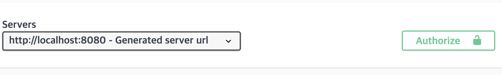

<!--more-->
작성중

## 📂 목차
- 
- 

---

## 📚 본문

### Swagger

소프트웨어 간에 상호작용을 하기 위해 제공하는게 바로 API 문서다. API 수가 많아지만 이런 문서 작성도 굉장히 버겁게 된다. 이런 문서를 자동화 할 수 있는 것이 바로 Swagger 이다.

#### API 문서화

개발자가 API 를 이해하고 사용할 수 있도록 구조, 요청 / 응답 방식, 인증, 오류 등을 정리한 문서이며 문서가 없거나 불완전하면 코드 분석, 문의 등 비효율이 발생하게 된다. 명확한 문서는 개발자 경험과 유지보수 효율을 높일 것이다.

**주요 요소**
- end point: URL, HTTP 메서드(GET/POST/PUT/DELETE)
- reuqest: 필요 파라미터, 헤더
- response: 응답 데이터 구조, HTTP status code
- Examples 요청/응답: 실제 호출 예시, 예상 결과
- Error Code 설명: 발생 가능한 오류 코드 및 해결 방법

#### Swagger 및 OpenAPI 개념 정리

Swagger 는 API 문서를 자동 생성/관리하는 도구이며 OpenAPI Specification 표준 기반으로 API 명세를 정의하고, 작성된 명세를 활용하여 문서, 테스트 UI, 코드 생성 등을 자동화할 수 있게 된다.

**OpenAPI Specification(OAS)**
- RESTful API 를 기술하는 표준 포맷
- YAML/JSON 형식으로 API 구조 정의
- 대부분의 언어/프레임워크에서 활용 가능
- Swagger UI, Redoc 등을 통해 문서 자동 생성 가능

#### Swagger 구성 요소

- Swagger UI
    - 브라우저 API 문서의 시각적 제공
    - API를 직접 테스트할 수 있는 인터랙티브 UI
- Swagger Editor
    - API 명세(YAML/JSON)를 작성하는 온라인 편집기
    - 실시간 미리보기
- Swagger Codegen
    - API 명세를 기반하여 클라이언트 SDK, 서버 스텁 코드 자동 생성

#### Swagger 장점

주요기능으로는 다음과 같다:

**자동화된 API 문서 생성**
Swagger 는 어플리케이션 코드에 작성한 애노테이션을 기반으로 API 문서를 자동으로 생성하는데, 별도의 작업 없이도 엔드포인트, 파라미터, 응답 구조 등이 자동으로 반영되기 때문에 문서를 직접 작성하던 시대와 비교하면 압도적으로 효율적이다.

**인터랙티브 API 테스트 기능 제공**
Swagger UI는 단순 문서가 아니라 브라우저에게 바로 API 를 호출해볼 수 있는 살아있는 테스트 환경을 제공하기 때문에 개발/QA/기획자가 `Postman`, `curl` 기능 없이 바로 API 를 검증할 수 있다는 큰 장점이 있다.

**언어 및 프레임워크 독립적 구조**
Swagger/OAS는 특정 언어나 프레임워크에 종속되지 않는다. Java(Spring), Node.js, Python(FastAPI), Golang 등 어떤 환경에서도 동일한 방식으로 문서를 작성하고 공유할 수 있어 팀 간 표준화가 수월하다.

**표준화된 API 명세(JSON/YAML) 제공**
API 구조를 JSON 또는 YAML 로 표현하는 Open API Specification(OAS) 를 그대로 따르게 된다. 이를 통해 도구 간 호환성이 높고, 외부 시스템과의 연동이나 API 관리 플랫폼에서도 바로 사용할 수 있다.

#### Swagger Dependency


implementation 'org.springdoc:springdoc-openapi-starter-webmvc-ui:2.8.5'


### Swagger 적용


@Configuration
@OpenAPIDefinition()
public class SwaggerConfig {
}


`OpenAPIDefinition` 는 메타 데이터를 설정하는 곳이다. 이 서비스의 title, version, description 등 swagger doc 의 상단에 표시할 문서 정보를 띄우게 된다.

#### OpenAPIDefinition 

안에 들어가는 속성을 정리하자.


    Info info() default @Info;

    Tag[] tags() default {};

    Server[] servers() default {};

    SecurityRequirement[] security() default {};

    ...


##### info 속성

`Info info` 는 API 메타 데이터 정보를 뜻한다. 다음 속성들이 또 있다.

- `String title`: API 이름
- `String version`: version 정보
- `String description`: API 설명
- `String termsOfService`: 이용약관 URL
- `Contact contact`: 개발자 혹은 조직의 연락 정보
- `License license`: 라이선스 정보 -> default 는 `@io.swagger.v3.oas.annotations.info.License` 이고 굳이 명시 안해도 된다.
- ...


@OpenAPIDefinition(
    info = @Info(
        title = "My API",
        description = "서비스 API 문서",
        version = "v1.0.0"
    )
)
public RestController {
    ...
}


##### tags 속성

`Tag[] tags` 는 각 컨트롤러 또는 API 그룹에 대한 태그를 **전역 선언**하는 기능이며, Swagger UI 에서 API 를 카테고리별로 정렬하고 설명을 붙일 수 있다.

- `String name`: 설명 생략
- `String description`: 설명 생략


tags = {
    @Tag(name = "User", description = "사용자 관련 API"),
    @Tag(name = "Auth", description = "인증 관련 API")
}


##### servers 속성

`Server[] servers` 는 API 호출 서버 주소 목록을 문서화하며, Swagger UI 에서 API 호출 시 기본적으로 연결할 서버 주소를 명시한다. 환경별(로컬, 개발, 운영) 서버 URL 을 제공할 때 사용

- `String url`: 생략
- `String description`: 생략
- `ServerVariable[] variables`:


servers = {
    @Server(url = "http://localhost:8080", description = "Local Server"),
    @Server(url = "https://api.example.com", description = "Production Server")
}


##### security 속성

`SecurityRequirement[] security` 는 전역 보안 설정, API 전체에 적용할 인증/인가 방식을 정의한다(ex. JWT, OAuth2, ...).

- `String name`: 생략
- `String[] scopes`:


security = {
    @SecurityRequirement(name = "JWT")
}


> `@SecuritySchema` 도 설정해야 함

#### Swagger Configuration

info 만 우선 적절히 명시해주고 실행시킨 후 다음 url 로 들어가자.


@Configuration
@OpenAPIDefinition(
		info = @Info(
				title = "Swagger 실습 문서",
				description = "Swagger 실습을 위한 문서입니다.",
				termsOfService = "http://localhost:8080/이용약관",
				contact = @Contact(
						name = "Seonghun Park",
						url = "https://github.com/seonghun120614",
						email = "seonghun120614@gmail.com"
				)
		)
)
public class SwaggerConfig { }



http://localhost:8080/swagger-ui/index.html


위가 떴다면 성공이다. 이제 컨트롤러를 몇 개 작성 후에 태그를 써보자.

##### Controller 작성


@RestController
public class AuthController implements APIEndPoint {

	@PostMapping("/login")
	public String login(String username, String password) { return "login"; }

	@PostMapping("/register")
	public String register(String username, String password) { return "register complete"; }

	@GetMapping("/user")
	public String user(String username) { return "user"; }
}


위와 같이 작성해주고 돌리면 swagger ui 에는 해당 컨트롤러의 endpoint 가 뜨진 않는다. 이 또한 등록을 해줘야 하는데, `@Operation` 을 사용하여 등록할 수 있다(Controller 에서 사용해야 한다).


@RestController
... {
    @Operation
    ...
}


위처럼 작성한다. `Operation` 도 당연히 속성들이 있다. 다음을 보자.

**Controller 의 endpoint method 들에게 @Operation 적용하기**
- `String summary`: API 의 간단한 요약 설명이 들어간다, Swagger UI 목록에서 가장 눈에 띄며, 간단히 작성한다.
- `String description`: summary 보다는 더 자세한 설명을 써준다.
- `String[] tags`: 해당 API 를 특정 그룹으로 묶는 태그이다. 이것이 바로 Config 쪽의 `OpenAPIDefinition` 의 `tags` 쪽에 넣으면 된다.
- `Parameter[] parameters`: 메서드 파라미터 정보를 명시적으로 정의하며, 자동 감지가 되지만, 설명/예시/필수 여부를 정교하게 제어하고 싶을 때만 사용한다.
- `RequestBody requestBody`: RequestBody 의 설명, 예제 값을 추가할 때 사용하며, DTO 에 Swagger 설명이 없거나 별도의 예제가 필요할 때 사용한다, 기본적으로 default 값이 있어서 굳이 설정 안해줘도 된다.
- `ApiResponse[] responses`: API 의 응답 코드별 설명 및 스키마 정의, 성공/실패 케이스를 문서화할 때 필수
- `SecurityRequirement[] security`: 해당 API에 적용할 보안을 정의, 전역 보안이 있지만, 특정 API 에서만 수정할 때 사용


@Operation(
    summary = "회원 조회",
    description = "userId로 특정 회원 정보를 조회합니다.",
    tags = {"User"},
    parameters = {
        @Parameter(name = "userId", description = "회원 ID", required = true)
    },
    responses = {
        @ApiResponse(responseCode = "200", description = "조회 성공"),
        @ApiResponse(responseCode = "404", description = "해당 회원을 찾을 수 없음")
    },
    security = @SecurityRequirement(name = "JWT")
)


이때 tag 는 class 수준에서도 걸 수 있으며(`@Tag` 애노테이션), parameters 또한 인자 수준에서 `@Parameter` 를 걸어주어 할 수도 있다.


@Operation(
        summary = "회원가입",
        description = "회원가입하는 API",
        tags = "non-auth",
        responses = {
                @ApiResponse(description = "회원가입 성공", responseCode = "200"),
                @ApiResponse(description = "회원가입 실패", responseCode = "404")
        }
)
@PostMapping("/register")
public String register(
        @Parameter(
                name = "username",
                required = true,
                allowEmptyValue = false,
                example = "honggildong")
        String username,
        String password) {
    return "register complete";
}


위와 같이 작성하고 실행해보자.

이제 security 속성을 설정해보자.

##### Security 설정

Swagger에서는 API 보안을 두 단계로 정의한다:

- **Security Schemes**: 보안 메커니즘 정의 (어떤 인증 방식을 사용할지)
- **Security Requirements**: 실제 적용 (어떤 엔드포인트에 적용할지)

**주요 보안 타입**

1. API Key 인증

가장 간단한 형태이며, 헤더나 쿼리 파라미터로 인증 정보를 전달하는 형태이다.


# OpenAPI 3.0 예시
components:
  securitySchemes:
    ApiKeyAuth:
      type: apiKey
      in: header           # header, query, cookie 가능
      name: X-API-Key      # 실제 키 이름

# 전역 적용
security:
  - ApiKeyAuth: []

# 특정 엔드포인트만 적용
paths:
  /users:
    get:
      security:
        - ApiKeyAuth: []


코드 예시:

@Configuration
public class SwaggerConfig {
    
    @Bean
    public OpenAPI openAPI() {
        return new OpenAPI()
            .components(new Components()
                .addSecuritySchemes("ApiKeyAuth",
                    new SecurityScheme()
                        .type(SecurityScheme.Type.APIKEY)
                        .in(SecurityScheme.In.HEADER)
                        .name("X-API-Key")))
            .addSecurityItem(new SecurityRequirement()
                .addList("ApiKeyAuth"));
    }
}


2. JWT 보안 토큰

JWT 보안 토큰을 사용하고 싶을때 다음을 입력한다.


components:
  securitySchemes:
    BearerAuth:
      type: http
      scheme: bearer
      bearerFormat: JWT  # 선택사항, 문서화 목적

security:
  - BearerAuth: []


코드 예시:

@Bean
public OpenAPI openAPI() {
    return new OpenAPI()
        .components(new Components()
            .addSecuritySchemes("BearerAuth",
                new SecurityScheme()
                    .type(SecurityScheme.Type.HTTP)
                    .scheme("bearer")
                    .bearerFormat("JWT")
                    .description("JWT 토큰을 입력하세요")))
        .addSecurityItem(new SecurityRequirement()
            .addList("BearerAuth"));
}


3. Basic Auth


components:
  securitySchemes:
    BasicAuth:
      type: http
      scheme: basic

security:
  - BasicAuth: []


코드 예시:

.addSecuritySchemes("BasicAuth",
    new SecurityScheme()
        .type(SecurityScheme.Type.HTTP)
        .scheme("basic"))


4. OAuth 2.0


components:
  securitySchemes:
    OAuth2:
      type: oauth2
      flows:
        authorizationCode:
          authorizationUrl: https://example.com/oauth/authorize
          tokenUrl: https://example.com/oauth/token
          scopes:
            read:users: 사용자 정보 읽기
            write:users: 사용자 정보 쓰기
            admin: 관리자 권한

security:
  - OAuth2:
    - read:users
    - write:users


코드 예시:

@Bean
public OpenAPI openAPI() {
    return new OpenAPI()
        .components(new Components()
            .addSecuritySchemes("OAuth2",
                new SecurityScheme()
                    .type(SecurityScheme.Type.OAUTH2)
                    .flows(new OAuthFlows()
                        .authorizationCode(new OAuthFlow()
                            .authorizationUrl("https://example.com/oauth/authorize")
                            .tokenUrl("https://example.com/oauth/token")
                            .scopes(new Scopes()
                                .addString("read:users", "사용자 정보 읽기")
                                .addString("write:users", "사용자 정보 쓰기"))))))
        .addSecurityItem(new SecurityRequirement()
            .addList("OAuth2", Arrays.asList("read:users", "write:users")));
}



@OpenAPIDefinition(
		info = @Info(
				title = "Swagger 실습 문서",
				description = "Swagger 실습을 위한 문서입니다.",
				termsOfService = "http://localhost:8080/이용약관",
				contact = @Contact(
						name = "Seonghun Park",
						url = "https://github.com/seonghun120614",
						email = "seonghun120614@gmail.com"
				)
		),
		security = @SecurityRequirement(name = "bearerAuth")
)


위 방법들 중 하나를 작성하자. 이때 name 이 `bearerAuth` 를 가지는 `SecurityScheme` 을 정의해야 한다.


		security = @SecurityRequirement(name = "bearerAuth")
)
@SecurityScheme(
		name = "bearerAuth",
		type = SecuritySchemeType.HTTP,
		scheme = "bearer",
		bearerFormat = "JWT"
)


