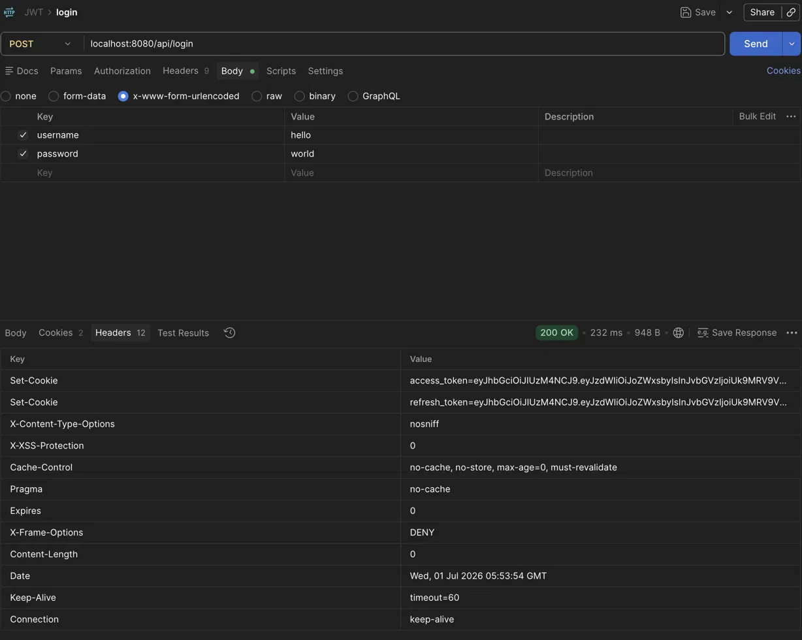
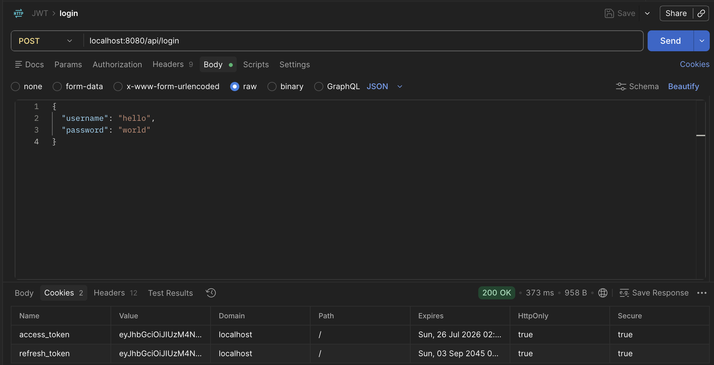
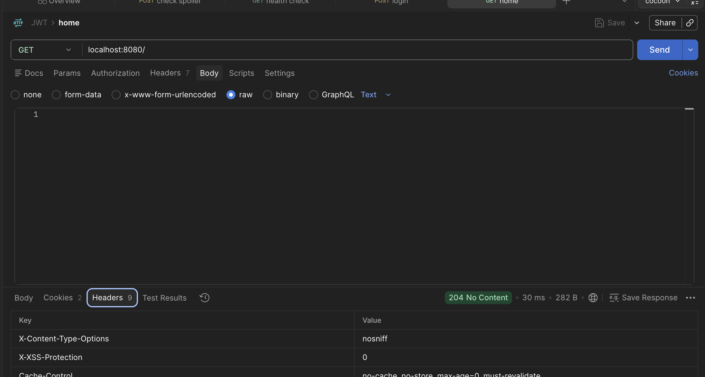
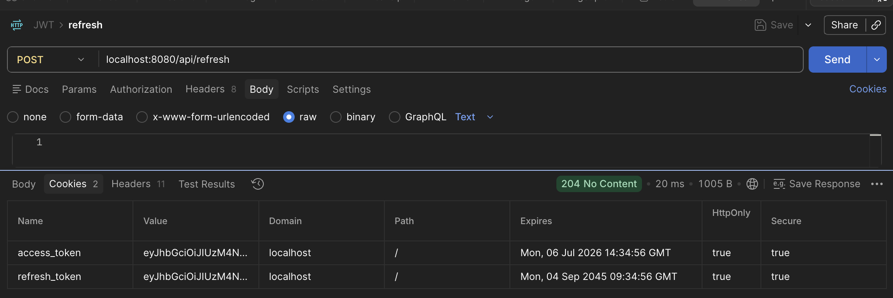

<!--more-->
Spring Boot - JWT 구현 복습

## 📂 목차
- [JWT 발급](#jwt-발급)
    - [1. CustomUsernamePasswordFilter 구현](#1-customusernamepasswordfilter-구현)
    - [2. CustomUsernamePasswordAuthentication 구현](#2-customusernamepasswordauthentication-구현)
    - [3. AuthenticationManager](#3-authenticationmanager)
    - [4. UserDetailsService](#4-userdetailsservice)
    - [5. 전체 흐름](#5-전체-흐름)
    - [6. successfulAuthentication](#6-successfulauthentication)
    - [7. SuccessHandler](#7-successhandler)
    - [8. FailureHandler](#8-failurehandler)
    - [9. Configuration](#9-configuration)
    - [(옵션) x-www-form-urlencoded 말고 json 으로 받기](#옵션-x-www-form-urlencoded-말고-json-으로-받기)
- [JWT 인증](#jwt-인증)
    - [10. JWT Parsing](#10-jwt-parsing)
    - [11. JWT Refresh](#11-jwt-refresh)
- [JWT Blacklist](#jwt-blacklist)
    - [12. JTI 생성](#12-jti-생성)
    - [13. Logout](#13-logout)

---

## 📚 본문

JWT 는 로그인 구현을 위한 유명한 토큰 기반 인증 방식이다. 우선 이를 위해 `UserPasswordAuthentication` 을 이용해 JWT 발급을 위한 필터를 개발한다

### JWT 발급

#### 1. CustomUsernamePasswordFilter 구현

`AbstractAuthenticaitonProcessingFilter` 를 구현하자.

```java
public class CustomUsernamePasswordFilter extends AbstractAuthenticationProcessingFilter {
    public static final String USERNAME_KEY = "username";
    public static final String PASSWORD_KEY = "password";

    private static final RequestMatcher DEFAULT_PATH_REQUEST_MATCHER = PathPatternRequestMatcher
            .withDefaults().matcher(HttpMethod.POST, "/api/login");

    private final ObjectMapper objectMapper;

    public CustomUsernamePasswordFilter(ObjectMapper objectMapper) {
        super(DEFAULT_PATH_REQUEST_MATCHER);
        this.objectMapper = objectMapper;
    }

    public CustomUsernamePasswordFilter(AuthenticationManager authenticationManager, ObjectMapper objectMapper) {
        super(DEFAULT_PATH_REQUEST_MATCHER, authenticationManager);
        this.objectMapper = objectMapper;
    }
}
```

`AuthenticationManager` 은 JWT 를 검증하는 주체이다. `authenticationManager` 는 나중에 만들고 `attemptAuthentication()` 을 구현하자.

```java
@Override
public Authentication attemptAuthentication(HttpServletRequest request,
                                            HttpServletResponse response) {
    // Filtering
    if (!request.getMethod().equals("POST"))
        throw new AuthenticationServiceException("Authentication method not supported: " + request.getMethod());

    // Parsing
    String username = request.getParameter(USERNAME_KEY);
    String password = request.getParameter(PASSWORD_KEY);
    if (username == null || password == null) username = password = "";

    // TODO: Auth - Manager 가 가공 할 만한 수준의 Authentication(authRequest) 으로 전환

    // Allow subclasses to set the details property
    return this.getAuthenticationManager().authenticate(authRequest);
}
```

여기서 마지막에는 `getAuthenticationManager` 를 통해 `authenticate` 를 하는 것을 볼 수 있다. 이제 `AuthenticationManager` 가 다룰 수 있는 `Authentication` 을 구현하자.

#### 2. CustomUsernamePasswordAuthentication 구현

```java
@Getter
public class UsernamePasswordAuthentication extends UsernamePasswordAuthenticationToken {

    // 인증 전
    public UsernamePasswordAuthentication(Object principal, Object credentials) {
        super(principal, credentials);
    }

    // 인증 후
    public UsernamePasswordAuthentication(Object principal, Object credentials,
                                          Collection<? extends GrantedAuthority> authorities) {
        super(principal, credentials, authorities);
    }
}
```

name, details 는 본인 서비스에 맞게 넣으면 된다. 이제 `AuthenticationManager` 를 구현하자.

#### 3. AuthenticationManager

```java
@RequiredArgsConstructor
public class UsernamePasswordAuthenticationManager
        implements AuthenticationManager {
    private final DaoAuthenticationProvider daoAuthenticationProvider;

    @Override
    public Authentication authenticate(Authentication authentication) throws AuthenticationException {
        return daoAuthenticationProvider.authenticate(authentication);
    }
}
```

필요한건 표준 정의된 빈으로 주입받도록 하자. 이때 `DaoAuthenticationProvider` 는 `UserDetailsService` 를 주입받는다. 따라서 `UserDetailsService`를 재구현하여 우리 DB 를 이용해 username, password 를 넣어주자.

#### 4. UserDetailsService

```java
@Service
@RequiredArgsConstructor
public class CustomUserDetailsService implements UserDetailsService {

    private final UserRepository userRepository;

    @Override
    public UserDetails loadUserByUsername(String username) throws UsernameNotFoundException {
        User user = userRepository.findByUsername(username)
                                  .orElseThrow(() -> new UsernameNotFoundException("The user could not be found or the user has no GrantedAuthority"));

        Set<GrantedAuthority> authorities = user.getRoles().stream()
                                                .map(SimpleGrantedAuthority::new)        // String → GrantedAuthority
                                                .collect(Collectors.toSet());

        return new CustomUserDetails(user.getUsername(),
                                     user.getPassword(),
                                     authorities);
    }
}
```

다시 돌아가서 `UsernamePasswordAuthenticationManager` 가 authenticate 를 할 때 위 객체를 이용해서 `retrieveUser` 를 통해 db 에서 유저를 가져올 수 있을 것이다.

#### 5. 전체 흐름

```java
@Override
public Authentication attemptAuthentication(HttpServletRequest request,
                                            HttpServletResponse response) {
    // Filtering
    if (!request.getMethod().equals("POST"))
        throw new AuthenticationServiceException("Authentication method not supported: " + request.getMethod());

    // Parsing
    String username = request.getParameter(USERNAME_KEY);
    String password = request.getParameter(PASSWORD_KEY);
    if (username == null || password == null) username = password = "";

    // Auth - Manager 가 가공 할 만한 수준의 Authentication 으로 전환
    UsernamePasswordAuthentication authRequest
            = new UsernamePasswordAuthentication(username, password);
    return this.getAuthenticationManager().authenticate(authRequest);
}
```

이제 `UserPasswordAuthentication` 을 통해 검증을 수행하고 `AuthenticationManager` 를 이용해서 인증을 수행하면 authenticated `UserPasswordAuthentication` 을 얻게 된다.

여기까지가 로그인의 과정이다. 이제 `successfulAuthentication` 을 보자.

#### 6. successfulAuthentication

`AuthenticationSuccessHandler`에 이미 구현되어 있는 추상 메서드는 다음과 같다.

```java
protected void successfulAuthentication(HttpServletRequest request, HttpServletResponse response, FilterChain chain,
			Authentication authResult) throws IOException, ServletException {
    SecurityContext context = this.securityContextHolderStrategy.createEmptyContext();
    context.setAuthentication(authResult);
    this.securityContextHolderStrategy.setContext(context);
    this.securityContextRepository.saveContext(context, request, response);
    if (this.logger.isDebugEnabled()) {
        this.logger.debug(LogMessage.format("Set SecurityContextHolder to %s", authResult));
    }
    this.rememberMeServices.loginSuccess(request, response, authResult);
    if (this.eventPublisher != null) {
        this.eventPublisher.publishEvent(new InteractiveAuthenticationSuccessEvent(authResult, this.getClass()));
    }
    this.successHandler.onAuthenticationSuccess(request, response, authResult);
}
```

검증했던 authResult 가 우리가 정의했던 `UsernamePasswordAuthentication` 이다. 그리고 이를 securityContextHolder 의 저장 방식에 따라 저장하고 있고, 그 뒤로 `rememberMeServices` 와 성공 후에 어디로 가야할지를 정하는 `successHandler` 가 있다. 여기서 remember 는 STATELESS 에 맞지 않으므로 과감히 뺀다

#### 7. SuccessHandler

```java
@Override
public void onAuthenticationSuccess(HttpServletRequest request,
                                    HttpServletResponse response,
                                    Authentication authentication
) {
    CustomUserDetails userDetails = (CustomUserDetails) authentication.getPrincipal();
    String name = Objects.requireNonNull(userDetails).getUsername();

    Set<String> roles = authentication.getAuthorities().stream()
                                        .map(GrantedAuthority::getAuthority)
                                        .collect(Collectors.toSet());

    //TODO: access, refresh 만들기
}
```

성공 시에는 JWT 토큰을 발급받아야 하기 때문에 `JwtProvider` 에 jwt 를 생성하는 메서드를 정의하자.

```java
public String createAccessToken(String username,
                                Set<String> roles) {
    return createToken(username, roles, jwtProperty.accessExpireMilliSeconds());
}

public String createRefreshToken(String username,
                                    Set<String> roles) {
    return createToken(username, roles, jwtProperty.refreshExpireMilliSeconds());
}

private String createToken(String username,
                            Set<String> roles,
                            long expireMilliSeconds) {
    Date now = new Date();
    Date expiry = new Date(now.getTime() + expireMilliSeconds);

    return Jwts.builder()
                .subject(username)
                .claim("roles", roles)
                .issuedAt(now)
                .expiration(expiry)
                .signWith(key)
                .compact();
}
```

이제 토큰을 만들러 가자.

```java
@Override
public void onAuthenticationSuccess(HttpServletRequest request,
                                    HttpServletResponse response,
                                    Authentication authentication
) {
    // ...

    String accessToken = jwtProvider.createAccessToken(name, roles);
    String refreshToken = jwtProvider.createRefreshToken(name, roles);

    // TODO: create Cookies
}
```

쿠키를 만드는 클래스를 만들고 책임을 위임하자.

```java
@Component
@RequiredArgsConstructor
public class CookieHandler {
    private final CookieProperty cookieProperty;

    public ResponseCookie createCookie(String name, String value, long maxAge) {
        return ResponseCookie.from(name, value)
                             .httpOnly(cookieProperty.httpOnly())
                             .secure(cookieProperty.secure())
                             .sameSite(cookieProperty.sameSite())
                             .path(cookieProperty.path())
                             .maxAge(maxAge)
                             .build();
    }
}
```

다시 돌아와서 쿠키를 만들고 response 에 넣어주자.

```java
@Override
public void onAuthenticationSuccess(HttpServletRequest request,
                                    HttpServletResponse response,
                                    Authentication authentication
) {
    // ...

    var accessCookie = cookieHandler.createCookie("access_token",
                                                                accessToken,
                                                                jwtProvider.getAccessExpirySeconds());
    var refreshCookie = cookieHandler.createCookie("refresh_token",
                                                    refreshToken,
                                                    jwtProvider.getRefreshExpirySeconds());

    response.addHeader(HttpHeaders.SET_COOKIE, accessCookie.toString());
    response.addHeader(HttpHeaders.SET_COOKIE, refreshCookie.toString());
}
```

이제 로직을 전부 다 짰다. 주의할 점은 다음과 같다.

> @ConfigurationProperties(prefix = "cookie")  
public record CookieConfig(  
        boolean httpOnly,  
        boolean secure,     // Local, Prod: false, https 발급시 true  
        String sameSite,    // Local, Prod: Lax, https 발급시 None  
        String path  
) {}

이제 `FailureHandler` 를 보자.

#### 8. FailureHandler

`FailureHandler` 는 인증에 실패했을때 대처하는 프로세스이다.

```java
catch (InternalAuthenticationServiceException failed) {
    this.logger.error("An internal error occurred while trying to authenticate the user.", failed);
    unsuccessfulAuthentication(request, response, failed);
}
catch (AuthenticationException ex) {
    // Authentication failed
    unsuccessfulAuthentication(request, response, ex);
}
```

우선 failure 호출은 success 를 하기 위해 인증을 수행할 때, 호출하고 있음을 볼 수 있다. 부모 메서드 `unsuccessfulAuthentication` 에는 다음 필수 프로세스를 정의하고 있다:

```java
protected void unsuccessfulAuthentication(HttpServletRequest request,
        HttpServletResponse response, AuthenticationException failed) {
    this.securityContextHolderStrategy.clearContext();
    this.rememberMeServices.loginFail(request, response);
    this.failureHandler.onAuthenticationFailure(request, response, failed);
}
```

1. `SecurityContextHolder` 정리: 해당 Thread 에서 요청되어 저장된 인증정보들을 삭제한다.
2. `AuthenticationException` 저장: 발생한 Exception 을 세션에 저장하게 되지만, `allowSessionCreation` 이 true 일때만 저장하기 때문에, JWT 의 STATELESS 특성을 가져가야 하는 것이라면 이 프로세스는 생략된다.
3. `RememberMeServices` 에게 실패 알림: `remember-me` 쿠키를 구웠던 것의 반대 되는 로직으로, 로그인이 실패했으니 혹시 남아 있던 `remember-me` 쿠키를 정리한다. 하지만 이도 없다.
4. `AuthenticationFailureHandler` 에게 위임: 이 로직을 우리가 짜야 한다.

두 번째 위의 코드에 보았던 `Exception` 을 살펴보자. 둘 다 예외가 발생했을때 `unsuccessfulAuthentication` 을 호출하지만, 그 예외 상황이 다르다.

- 첫번째 예외는 `InternalAuthenticationServiceException` 로 DB 장애 등의 시스템 문제로 발생하는 예외다(AuthenticationException 의 AuthenticationServiceException 을 상속 받고 있다).
- 두번째 예외는 `AuthenticationException` 예외로 우리가 생각하는 비번 틀림 등의 일반적인 예외다.

이제 `onAuthenticationFailure` 를 구현하자.

```java
@RequiredArgsConstructor
public class UsernamePasswordAuthenticationFailureHandler
        implements AuthenticationFailureHandler {

    private final ObjectMapper objectMapper;

    @Override
    public void onAuthenticationFailure(HttpServletRequest request,
                                        HttpServletResponse response,
                                        AuthenticationException exception
    ) throws IOException, ServletException {
        response.setStatus(HttpServletResponse.SC_UNAUTHORIZED);
        response.setContentType(MediaType.APPLICATION_JSON_VALUE);
        response.setCharacterEncoding(StandardCharsets.UTF_8.name());
        ErrorResponse body = new ErrorResponse(HttpServletResponse.SC_UNAUTHORIZED,
                                               "인증에 실패하였습니다.");
        objectMapper.writeValue(response.getWriter(), body);
    }

    public record ErrorResponse(int status, String message) {}
}
```

응답에 담을때는 Jackson 라이브러리의 핵심 클래스인 `ObjectMapper` 를 이용해 자바 객체를 JSON 문자열로 변환해서 보내주자. 보통 SpringBoot 에서 `JacksonAutoConfiguration` 을 통해 자동으로 생성해준다. 그래서 쓰기만 하면된다. 나중에 자바 객체를 Json 으로 바꿀때 세부 설정을 하고 싶을때 이를 공부하자.

> `writeValue` 는 `Writer` 인터페이스와 자바 전체 객체를 받는다.

#### 9. Configuration

이제 만든 것들을 조립하자. 우선 만든 `CustomUsernamePasswordAuthenticationFilter` 를 등록을 해준다.

```java
@Bean
public CustomUsernamePasswordFilter usernamePasswordFilter(
        CookieHandler cookieHandler,
        JwtProvider jwtProvider,
        ObjectMapper objectMapper,
        DaoAuthenticationProvider daoAuthenticationProvider
) {
    final var usernamePasswordAuthenticationManager
            = new UsernamePasswordAuthenticationManager(daoAuthenticationProvider);
    var usernamePasswordFilter = new CustomUsernamePasswordFilter(usernamePasswordAuthenticationManager,
                                                                    objectMapper);

    var usernamePasswordAuthenticationSuccessHandler
            = new UsernamePasswordAuthenticationSuccessHandler(jwtProvider, cookieHandler);
    var usernamePasswordAuthenticationFailureHandler
            = new UsernamePasswordAuthenticationFailureHandler(objectMapper);

    usernamePasswordFilter.setAuthenticationSuccessHandler(usernamePasswordAuthenticationSuccessHandler);
    usernamePasswordFilter.setAuthenticationFailureHandler(usernamePasswordAuthenticationFailureHandler);
    return usernamePasswordFilter;
}
```

Config 로 빈이 등록된 곳에 가서 SecurityFilterChain 에 이를 등록해준다.

```java
.addFilterAt(usernamePasswordFilter, UsernamePasswordAuthenticationFilter.class)
```

등록할 때는 기존에 등록되어 있는 것을 대체하자.



이제 유저는 cookie 를 얻게 될 것이다.

#### (옵션) x-www-form-urlencoded 말고 json 으로 받기

attemptAuthentication 쪽을 수정해주자.

```java
@Override
public Authentication attemptAuthentication(HttpServletRequest request,
                                            HttpServletResponse response) {
    // Filtering
    String contentType = request.getContentType();
    if (!request.getMethod().equals("POST"))
        throw new AuthenticationServiceException("Authentication method not supported: " + request.getMethod());
    if (contentType == null)
        throw new AuthenticationServiceException("Authentication method not supported: null");

    // Parsing
    LoginRequest loginRequest = null;
    if (contentType.contains(MediaType.APPLICATION_JSON_VALUE))
        loginRequest = jsonParsing(request);
    else if (contentType.contains(MediaType.APPLICATION_FORM_URLENCODED_VALUE))
        loginRequest = formParsing(request);
    else
        throw new AuthenticationServiceException("Authentication method not supported: " + contentType);

    // Auth
    validate(loginRequest);
    UsernamePasswordAuthentication authRequest
            = new UsernamePasswordAuthentication(loginRequest.username(), loginRequest.password());
    var auth = this.getAuthenticationManager().authenticate(authRequest);
    return auth;
}
```

contentType 으로 분기를 나누어 각기 다른 파싱을 진행한다.

```java
private void validate(LoginRequest req) {
    if (req.username() == null || req.password() == null ||
            req.username().isBlank() || req.password().isBlank())
        throw new AuthenticationServiceException("잘못된 입력입니다.");
}

private LoginRequest formParsing(HttpServletRequest request) {
    String username = request.getParameter(USERNAME_KEY);
    String password = request.getParameter(PASSWORD_KEY);
    if (username == null || password == null)
        username = password = "";
    return new LoginRequest(username, password);
}

private LoginRequest jsonParsing(HttpServletRequest request) throws AuthenticationException {
    try {
        var loginRequest = objectMapper.readValue(request.getInputStream(), LoginRequest.class);
        return loginRequest;
    } catch (IOException e) {
        throw new AuthenticationServiceException("로그인 요청 본문 파싱 실패", e);
    }
}

private record LoginRequest(String username, String password) {}
```

이제 양 쪽 전부 파싱이 가능하다. 실습은 건너뛴다.

### JWT 인증

로그인 후에는 사용자는 요청을 다시 보내주어야 한다. 이제 인증만을 위한 `JwtAuthenticationFilter` 를 짜자. `OncePerRequestFilter` 를 통해 짜는게 일반적인데, 서버 내부에서 요청을 다른 경로로 forward 할 때(컨트롤러가 에러 페이지로 forward) 그 요청이 필터 체인을 또 타기 때문에 이는 상당히 비효율적이므로 이 클래스를 쓴다.

```java
public class JwtAuthenticationFilter extends OncePerRequestFilter {
    @Override
    protected void doFilterInternal(HttpServletRequest request,
                                    HttpServletResponse response,
                                    FilterChain filterChain
    ) throws ServletException, IOException {
        
    }
}
```

`doFilterInternal` 을 구현하자.

#### 10. JWT Parsing

요청이 들어오면, JWT 를 읽어들여야 한다. 저번에 만들었던 쿠키 핸들러 클래스에 쿠키를 읽어들일 수 있는 메서드를 만들어주자.

```java
public Map<String, String> getMap(Cookie[] cookies) {
    if (cookies == null || cookies.length == 0)
        return Collections.EMPTY_MAP;
    return Arrays.stream(cookies)
                    .collect(Collectors.toMap(Cookie::getName, Cookie::getValue));
}
```

이제 access token 을 읽기 위한 준비를 하자.

```java
// Parsing
Map<String, String> tokens = cookieHandler.getMap(request.getCookies());

if (!tokens.containsKey("access_token")) {
    filterChain.doFilter(request, response);
    return;
}
```

읽어낼때 예외가 발생할 수 있으므로 예외처리를 해주고 try 문 안에서 인증 처리를 진행할 것이다.

```java
try {
    // TODO: 인증 처리
} catch (ExpiredJwtException e) {
    filterChain.doFilter(request, response);
} catch (JwtException | IllegalArgumentException e) {
    // TODO: 에러 처리
}
```

인증을 할 때에는 Authentication 을 정의해야 한다.

```java
@Getter
@RequiredArgsConstructor
public class JwtAuthentication implements Authentication {
    final Object principal;
    final Collection<? extends GrantedAuthority> authorities;

    Object credentials = null;
    Object details = null;
    @Setter
    boolean authenticated = true;

    @Override
    public String getName() {
        return principal.toString();
    }
}
```

access 토큰을 읽어서 먼저 인증을 진행하는 로직을 짜자

```java
try {
    String accessToken = tokens.get("access_token");
    Claims accessClaim = jwtProvider.parse(accessToken);

    String username = accessClaim.getSubject();
    List<String> roles = accessClaim.get("roles", List.class);
    List<GrantedAuthority> authorities = roles.stream()
                                                .map(SimpleGrantedAuthority::new)
                                                .collect(Collectors.toList());
    var jwtAuth = new JwtAuthentication(username, authorities);

    SecurityContextHolder.getContext().setAuthentication(jwtAuth);
    filterChain.doFilter(request, response);
} catch // ...
```

이때, access 가 만료되면 처리해줄 필터가 필요하다. 처리할 필터를 정의해주자.

#### 11. JWT Refresh

authentication 과는 다르게 shouldNotFiltered 를 정의해서 Filter 를 거치지 않을 url path 를 등록해주자. 이때 참 거짓을 헷갈리지 말자. true 면 이 필터를 건너뛰게 된다.

```java
@Component
@RequiredArgsConstructor
public class JwtRefreshFilter extends OncePerRequestFilter {
    // ...

    @Override
    protected boolean shouldNotFilter(HttpServletRequest request) {
        return !INCLUDE_PATHS.equals(request.getRequestURI());
    }
}
```

이제 JwtAuth 필터와 유사하게 `doFilterInternal` 을 정의해준다.

```java
@Override
protected void doFilterInternal(HttpServletRequest request,
                                HttpServletResponse response,
                                FilterChain filterChain
) throws ServletException, IOException {
    // Parsing
    Map<String, String> tokens = cookieHandler.getMap(request.getCookies());

    try {
        String oldRefreshToken = tokens.getOrDefault("refresh_token", "");
        Claims refreshClaim = jwtProvider.parse(oldRefreshToken);

        String name = refreshClaim.getSubject();
        List<String> roleList = oldRefreshClaim.get("roles", List.class);
        Set<String> authorities = new HashSet<>(roleList);

        // TODO: JWT 토큰 새로 만들기

    } catch (JwtException | IllegalArgumentException e) {
        response.setStatus(HttpStatus.UNAUTHORIZED.value());
        response.setContentType(MediaType.APPLICATION_JSON_VALUE);
        response.setCharacterEncoding(StandardCharsets.UTF_8.name());
        response.getWriter().write("잘못된 형식");
    }
}
```

만들었으면 이를 응답에 넣어서 보내주자.

```java
String accessToken = jwtProvider.createAccessToken(name, authorities);
String refreshToken = jwtProvider.createRefreshToken(name, authorities);

var accessCookie = cookieHandler.createCookie("access_token",
                                                accessToken,
                                                jwtProvider.getAccessExpirySeconds());
var refreshCookie = cookieHandler.createCookie("refresh_token",
                                                refreshToken,
                                                jwtProvider.getRefreshExpirySeconds());

response.addHeader(HttpHeaders.SET_COOKIE, accessCookie.toString());
response.addHeader(HttpHeaders.SET_COOKIE, refreshCookie.toString());
response.setStatus(HttpServletResponse.SC_NO_CONTENT);
```

이제 잘 돌아가는지 확인해보자.





의도대로 no content 를 받았다. 이제 `/api/refresh` 로 POST 요청을 보내자.

```java
.requestMatchers(HttpMethod.POST, "/api/login", "/api/refresh").permitAll()
```

설정도 잊지말자.



제대로 업데이트 되는 것을 볼 수 있다. 하지만 이게 끝이 아니다.

### JWT Blacklist

JWT 를 새로 발급 받았다는 것은 기존 JWT 는 인증을 못하게 해야한다. 학습 전용으로 JWT black 전용 인메모리 Repository 를 임시로 만들자.

```java
public class JwtBlackRepositoryImpl implements JwtBlackRepository {
    private final static ConcurrentMap<String, Set<String>> CONCURRENT_MAP = new ConcurrentHashMap<>();

    @Override
    public void black(String username, String value) {
        CONCURRENT_MAP.getOrDefault(username, new HashSet<>()).add(value);
    }

    @Override
    public boolean exists(String username, String value) {
        Set<String> set = CONCURRENT_MAP.getOrDefault(username, Collections.emptySet());
        return !set.isEmpty() && set.contains(value);
    }
}
```

JWT 인증 방식에서는 보통 refresh token 만 넣는다. 그 이유는 access token 은 그냥 만료되게 두면 되며, 이는 짧기 때문이며, 조회가 잦은 access token 처리 쪽에 blacklist 기능을 넣으면 성능이 떨어질 우려가 있다. 물론 단점으로는 로그아웃 이후에 access token 을 등록하지 않기 때문에 만료 시간 이내에만 access token 으로 조회만 한다면 로그인이 가능하다는 보안 우려가 있다. 하지만 이 정도는 감수하고 refresh 만을 저장한다.

또한 refresh 전체를 저장하기 보다 refresh token 을 구분할 수 있는 UUID 를 생성해 토큰에 실어나르면 더 좋다. 이를 JTI(JWT ID) 라고 한다.

#### 12. JTI 생성

```java
public String createRefreshToken(String username,
                                    Set<String> roles) {
    String jti = UUID.randomUUID().toString();
    Date now = new Date();
    Date expiry = new Date(now.getTime() + jwtProperty.refreshExpireMilliSeconds());

    return Jwts.builder()
                .id(jti)
                .subject(username)
                .claim("roles", roles)
                .issuedAt(now)
                .expiration(expiry)
                .signWith(key)
                .compact();
}
```

식별할 수 있는 jti 를 만들었으니 JWT repository 를 갱신해주자. jti 는 만료 시각을 정해주어야 서버에서 계속 이 jti 를 저장하지 않게 되고 메모리 누수를 막을 수 있다.

```java
public interface JwtBlackRepository {

    void black(String jti, long expiredAt);

    boolean exists(String jti);
}

// ==========================

@Component
public class JwtBlackRepositoryImpl implements JwtBlackRepository {
    private final ConcurrentMap<String, Long> store = new ConcurrentHashMap<>();

    @Override
    public void black(String jti, long expiredAt) {
        store.put(jti, expiredAt);
    }

    @Override
    public boolean exists(String jti) {
        Long expiredAt = store.get(jti);
        if (expiredAt == null) return false;
        if (expiredAt < System.currentTimeMillis()) {
            store.remove(jti);
            return false;
        }
        return true;
    }
}
```

이제 이를 logout 에 구현해주자.

> 구현을 들어가기 전에 다음 기능을 익히자: `@AuthenticationPrincipal`, `@CookieValue`

#### 13. Logout

로그아웃 로직을 다음과 같이 구현하자.

```java
@PostMapping("/")
public ResponseEntity<Void> logout(@CookieValue("refresh_token") String refreshToken,
                                    HttpServletResponse response) {
    if (refreshToken != null) {
        try {
            Claims claims = jwtProvider.parse(refreshToken);
            long expiredAt = claims.getExpiration().getTime();
            jwtBlackRepository.black(claims.getId(), expiredAt);
        } catch (JwtException | IllegalArgumentException ignored) { }
    }

    response.addHeader(SET_COOKIE, cookieHandler.createCookie("access_token", "", 0).toString());
    response.addHeader(SET_COOKIE, cookieHandler.createCookie("refresh_token", "", 0).toString());

    return ResponseEntity.noContent().build();
}
```

이제 이를 filter 에서 해당 refresh 가 만료됐는지 감지만 해주면 된다.

```java
if (jwtBlackRepository.exists(refreshClaim.getId())) {
    response.setStatus(HttpStatus.UNAUTHORIZED.value());
    response.setContentType(MediaType.APPLICATION_JSON_VALUE);
    response.setCharacterEncoding(StandardCharsets.UTF_8.name());
    response.getWriter().write("잘못된 형식");
    return;
}
```

JwtRefresh 필터로 가서 무효회된 토큰이면 401 응답을 보내고, refresh 이후에 새로 만든 refresh token 만을 인가할 수 있게 하기 위해 이전의 old refresh token 을 black 처리 해준다.

```java
// ...
// 만들기 전 jti black
jwtBlackRepository.black(jti, oldRefreshClaim.getExpiration().getTime());
```

RefreshToken 을 저장하여 유저가 refresh 를 탈취 당했을 때 이를 차단할 수 있게 저장도 해야하지만, 이는 redis 를 배운 후에 구현하도록 한다.

> Link: [Spring JWT](https://github.com/seonghun120614/Spring-JWT)