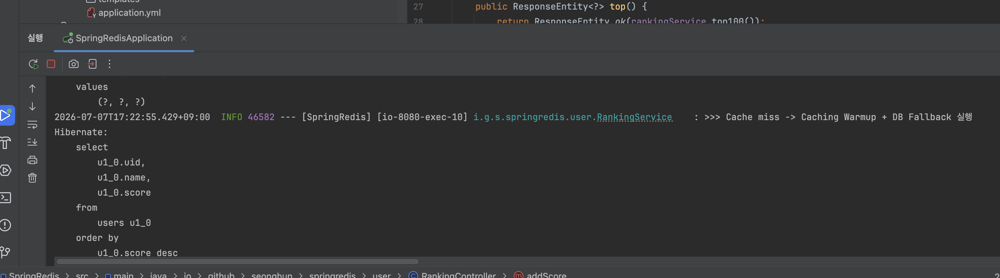

<!--more-->

## 📂 목차
- [Redis 핵심 기낭](#redis-핵심-기능)
- [왜 빠른가?](#왜-빠른가)
- [활용 패턴](#활용-패턴)
    - [1. Config & Caching](#1-config--caching)
    - [2. Session Storage](#2-session-storage)
    - [3. Real-time Queue](#3-real-time-queue)
        - [Real-time Ranking](#real-time-ranking)
        - [(옵션) Cache Miss Fallback](#옵션-cache-miss-fallback)
    - [4. Distributed Lock](#4-distributed-lock)
- [Redis 특성](#redis-특징)
- [TTL 과 만료](#ttl-과-만료)
- [영속성](#영속성)
- [캐시 사용 시 주의할 문제](#캐시-사용-시-주의할-문제)

---

## 📚 본문

REmote DIctionary Server 메모리에 데이터를 저장하는 인메모리 데이터 저장소이다.

### Redis 핵심 기능

- **인메모리(In-memory)**: 데이터를 디스크가 아닌 RAM에 둠 → 매우 빠름(마이크로초 단위). 디스크 기반 RDB(수 밀리초)보다 수십 ~ 수백 배 빠름.
- **Key-Value 구조**: 기본은 키로 값을 저장/조회. 단, 값의 타입이 단순 문자열이 아니라 풍부함
- **싱글 스레드**: 명령을 한 번에 하나씩 순차 처리. 이게 Redis 이해의 핵심 열쇠

### 왜 빠른가?

- 메모리 접근: 디스크 I/O가 없음
- 싱글 스레드 이벤트 루프: 동시성 제어를 위한 락(lock)이 필요 없어서 **컨텍스트 스위칭** 혹은 **경합 비용**이 없음, 즉, 락 오버헤드 제거 + 메모리 기반이라 오히려 단순하고 빠름
- 효율적 자료구조: 각 데이터 타입마다 최적화된 내부 구현

### 활용 패턴

우선 Redis 서버를 띄우자.

```java
docker run -d -p 6379:6379 redis
```

redis 와 통신하기 위해서는 다음 dependencies 를 추가한다:

```text
implementation 'org.springframework.boot:spring-boot-starter-data-redis'
```

구성 설정은 다음과 같이 해주면 소통할 수 있다.

```yml
spring:
  data:
    redis:
      host: localhost
      port: 6379
```

#### 1. Config & Caching

DB 앞에서 Redis 를 두고 자주 사용하는 패턴은 Cache-Aside 패턴이다.

1. 요청을 받은 쪽에서 서비스 단에 Redis 가 해당 요청을 가로채서 `Cache Hit` 이 되면 해당 value 를 변환해서 줌
2. 만약 `Cache Miss` 가 뜨면 DB 를 조회해서 Redis 에 저장 후 변환하게 됨

이를 통해 대용량 데이터 조회에 대해 이전에 조회한 이력이 있으면 캐시 값을 조회해보고 바로바로 반환할 수 있도록 캐싱이 가능하다. `@EnableCaching` 만 붙이면 바로 사용할 수 있지만, TTL과 JSON 직렬화를 지정하는 게 실무에선 필수다. 구성 설정은 서비스에 맞게 한다.

```java
@RequiredArgsConstructor
@Configuration
public class RedisCacheConfig {
    @Bean
    public CacheManager cacheManager(RedisConnectionFactory connectionFactory) {

    }
}
```

`RedisConnectionFactory` 는 redis 와의 커넥션을 만들어주는 팩토리 메서드 패턴 객체이다. 미리 만들어져 있기 때문에 주입 받아서 설정을 건드릴 때 사용하자.

```java
private RedisCacheConfiguration(TtlFunction ttlFunction, Boolean cacheNullValues, Boolean enableTimeToIdle,
        Boolean usePrefix, CacheKeyPrefix keyPrefix, SerializationPair<String> keySerializationPair,
        SerializationPair<?> valueSerializationPair, ConversionService conversionService) {

    this.ttlFunction = ttlFunction;
    this.cacheNullValues = cacheNullValues;
    this.enableTimeToIdle = enableTimeToIdle;
    this.usePrefix = usePrefix;
    this.keyPrefix = keyPrefix;
    this.keySerializationPair = keySerializationPair;
    this.valueSerializationPair = (SerializationPair<Object>) valueSerializationPair;
    this.conversionService = conversionService;
}
```

`RedisCacheConfiguration` 클래스를 만들어서 구성설정을 커스터마이징 할 수 있다. RedisConfiguration 은 위와 같은 인자들을 받아서 생성시킬 수 있다. 하지만 이 모든 것을 다 외울 필요는 없고 기본적으로 `defaultCacheConfig()` 만 가져와 setter 기능을 가진 메서드들을 이용해서 설정해주자.

```java
RedisCacheConfiguration config = RedisCacheConfiguration.defaultCacheConfig()
        .entryTtl(Duration.ofMinutes(5))          // TTL 5분
        .disableCachingNullValues()                // null은 캐싱 안 함
        .serializeValuesWith(
            // TODO: SerializationPair<?> valueSerializationPair 넣기
        );
```

5 분의 TTL 을 설정하고, null 값은 직렬화에서 무시하도록 `disableCachingNullValues()` 를 세팅한다. 여기서 `serializeValuesWith` 에는 `SerializationPair<?> valueSerializationPair` 을 넣어줘야 한다. 이 객체에는 `Serializer` 와 `Deserializer` 가 들어가 있어야 한다. 그렇다면 `SerializationPair` 에 그 해답이 있다. `SerializationPair` 는 인터페이스이고, 이 안의 `fromSerializer` 라는 함수에 우리가 가져왔던 의존성에 여기에 넣을 수 있는 구현체가 들어가있다.

```java
RedisSerializationContext.SerializationPair.fromSerializer(
    RedisSerializer.json()
)
```

위를 serializeValuesWith 에 넣어주면 되겠다.

```java
return RedisCacheManager.builder(connectionFactory)
                .cacheDefaults(redisCacheConfiguration)
                .build();
```

이제 return 값으로 `RedisCacheManager` 를 주기 때문에 빌더 패턴을 이용하여 `RedisCacheManager` 를 넘겨주면 된다. 이제 다 끝났다 캐싱 기능을 켜주고, 도메인을 하나 정의하고 이를 통해 캐싱해보자.

```java
@EnableCaching
public class RedisCacheConfig {

@SpringBootApplication
@EnableCaching
public class SpringRedisApplication {
```

Config 에 붙여도 되고 Application 에 직접 붙여도 된다.

```java
public interface ProductRepository extends JpaRepository<Product, Long> { }

@Entity
@Table(name = "products")
@Getter
public class Product {
    @Id
    @GeneratedValue(strategy = GenerationType.SEQUENCE, generator = "product_seq")
    @SequenceGenerator(name = "product_seq", sequenceName = "product_seq", allocationSize = 50)
    Long id;
}

@RestController
@RequestMapping("/products")
@RequiredArgsConstructor
public class ProductController {

    private final ProductService productService;

    @GetMapping("/{id}")
    public Product getProduct(@PathVariable Long id) {
        return productService.getProduct(id);
    }

    @PostMapping
    public Product saveProduct() {
        return productService.save();
    }
}

@Service
@RequiredArgsConstructor
public class ProductService {
    private final ProductRepository productRepository;

    @Transactional(readOnly = true)
    @Cacheable(cacheNames = "products", key = "#id")
    public Product getProduct(Long id) {
        return productRepository.findById(id).orElseThrow();
    }

    @Transactional
    public Product save() {
        return productRepository.save(new Product());
    }
}
```

필자는 Postgres 연동을 시켰다. MySQL 을 써도 된다. 서비스에서 주의 깊게 보아야 할 것은 `@Cacheable(cacheNames = "products", key = "#id")` 이다. 의미는 Redis 에서 products 라는 캐시에 id 값을 키로 찾아보고 있으면 메서드를 실행하지 않고 바로 해당 값을 가져와 반환(cache hit)하고, 아니라면 DB 에서 조회하여 이를 redis 에 저장하면서 반환한다(cache miss). 이 동작은 이 함수의 제어를 가로채어 동작하게 된다. Redis 에 저장되는 모습을 보자.


한 product 를 생성하여 조회를 하여 지연시간 차이를 비교해보자.


첫번째 조회이다. 첫번째는 cache miss 가 되어 DB 에 조회를 하여 redis 에 저장도 하고 응답도 보내는 구조이다.


두번째 조회에서는 cache hit 가 발생하여 246ms 에서 47ms 로 줄어들은 것을 알 수 있다. 약 5배 빨라졌다.


세번째 조회에서는 더 빨라졌다. 6ms 밖에 안걸리는 것을 볼 수 있다.

두번째는 왜 세번째처럼 되지 않았을까? 그 이유는 다음과 같다:

1. Redis 연결 풀 초기화: Lettuce 커넥션 풀은 보통 lazy하게 초기화 되어서 2번째 요청에서 처음으로 Redis에 실제 연결을 맺느라 TCP 핸드셰이크 + 커넥션 셋업 비용이 한 번 발생하게 된다. 세번째부터는 미리 만들어져 있는 커넥션을 재사용하니 이런 과정을 거칠 필요가 없는 것이다.
2. JIT 컴파일: JVM은 처음엔 바이트코드를 인터프리터로 실행하다가, 자주 불리는 메서드를 감지하면 그때서야 네이티브 코드로 JIT 컴파일한다. 이는 Lazy Initialize 와 비슷한 맥락이다.
3. Jackson 웜업: JSON을 Product 객체로 되돌릴때 Jackson이 해당 타입의 리플렉션 정보를 처음 분석하게 되며, 이게 첫 역직렬화 때 이 분석 비용이 들기 때문이다.

결국에는 Lazy 하게 동작하기 때문에 지연이 일어난 것이다. Redis 의 진짜 성능은 3번째 결과이다.

#### 2. Session Storage

여러 서버 인스턴스로 스케일아웃하면 세션을 각 서버 메모리에 두면 안 되고(요청이 다른 서버로 가면 세션 유실),  
공유 세션 저장소가 필요함. 이때 Redis가 이런 역할을 하게 된다.

JWT는 stateless라 로그아웃/무효화가 어렵다 했다. 하지만 Redis에 블랙리스트(무효화된 토큰)나 Refresh Token을 저장하면, 모든 인스턴스가 같은 Redis를 보므로 즉시 무효화가 가능해진다. TTL을 토큰 만료시간과 맞추면 자동 정리까지 되게 된다.

이를 저번 JWT 구현체에 이어 업그레이드 해보자. 그 전에 Redis 에 직접 명령을 내릴 수 있는 `StringRedisTemplate` 설정을 해주어야 한다. 이를 이용해 Redis에 값을 넣고, 꺼내고, 지우고, TTL을 거는 모든 걸 할 수 있다.

```java
@Bean
public StringRedisTemplate stringRedisTemplate(RedisConnectionFactory cf) {
    return new StringRedisTemplate(cf);
}
```

위를 이용해 할 수 있는 메서드는 다음과 같다:

| 메서드 | Redis 자료구조 | 대응 명령어 | 쓰임새 |
|--------|--------------|-----------|--------|
| `opsForValue()` | String (단순 값) | `SET`, `GET` | 블랙리스트, 캐시, 카운터 |
| `opsForList()` | List | `LPUSH`, `RPOP` | 큐, 최근 목록 |
| `opsForSet()` | Set | `SADD`, `SISMEMBER` | 중복 없는 집합 |
| `opsForZSet()` | Sorted Set | `ZADD`, `ZRANGE` | 랭킹, 리더보드 |
| `opsForHash()` | Hash | `HSET`, `HGET` | 객체를 필드별로 저장 |

이제 이를 이용해 redis 에 직접 명령을 내리는 클래스를 구현하자.

```java
@RequiredArgsConstructor
@Component
public class RedisUtil {
    private final StringRedisTemplate stringRedisTemplate;

    @Transactional
    public void save(String prefix,
                     String userId,
                     String value,
                     long ttlMillis
    ) {
        stringRedisTemplate.opsForValue().set(
                prefix + userId,
                value,
                Duration.ofMillis(ttlMillis)
        );
    }

    @Transactional(readOnly = true)
    public boolean isValidAndEquals(String prefix,
                                    String userId,
                                    String value) {
        String cur = stringRedisTemplate.opsForValue().get(prefix + userId);
        if (cur != null)
            return cur.equals(value);
        return false;
    }

    @Transactional(readOnly = true)
    public String get(String prefix, String userId) {
        return stringRedisTemplate.opsForValue().get(prefix + userId);
    }

    @Transactional
    public void delete(String prefix,
                       String userId) {
        stringRedisTemplate.delete(prefix + userId);
    }
}
```

위를 이용해 RefreshToken 을 저장, 조회, 삭제하는 서비스를 만들자.

```java
@Service
@RequiredArgsConstructor
public class RefreshTokenService {
    private final RedisUtil redisUtil;

    private static final String PREFIX = "refresh:";
    private static final long TTL_MILLIS = 604800000L;

    @Transactional
    public void save(String userId, String refreshToken) {
        redisUtil.save(
                PREFIX,
                userId,
                refreshToken,
                TTL_MILLIS
        );
    }

    @Transactional(readOnly = true)
    public boolean isValid(String userId, String refreshToken) {
        return redisUtil.isValidAndEquals(PREFIX, userId, refreshToken);
    }

    @Transactional
    public void delete(String userId) {
        redisUtil.delete(PREFIX, userId);
    }
}
```

이제 블랙리스트에 등록하는 서비스도 만들자.

```java
@Service
@RequiredArgsConstructor
public class TokenBlacklistService {
    private static final String PREFIX = "blacklist:";

    private final RedisUtil redisUtil;

    public void blacklist(String jti, long remainingMillis) {
        if (remainingMillis <= 0)
            return;
        redisUtil.save(PREFIX, jti, "logout", remainingMillis); // 값은 아무거나 해도 무상관
    }

    public boolean isBlacklisted(String jti) {
        return redisUtil.get(PREFIX, jti) != null;
    }
}
```

refresh 필터로 가서 데이터 소스를 사용하고 있는 코드를 리팩토링하자.

```java
if (tokenBlacklistService.isBlacklisted(oldRefreshClaim.getId())) {
    response.setStatus(HttpStatus.UNAUTHORIZED.value());
    response.setContentType(MediaType.APPLICATION_JSON_VALUE);
    response.setCharacterEncoding(StandardCharsets.UTF_8.name());
    response.getWriter().write("무효화된 토큰");
}
```

refresh 필터에서 blacklist 가 있는지 여부를 검사해주면 된다. 그리고 리프레시를 저장하는 데이터 소스를 DB 로 두지 않고, 레디스가 저장하게 만들자. 그리고 이전에는 refresh 를 저장하지 않았다. 지금은 만들고 저장하는 코드까지 넣어주자.

```java
@Override
public void onAuthenticationSuccess(HttpServletRequest request,
                                    HttpServletResponse response,
                                    Authentication authentication
) {
    // ...

    String[] jtiRefreshToken = jwtProvider.createRefreshToken(name, roles);

    refreshTokenService.save(name, jtiRefreshToken[0]);

    var accessCookie = cookieHandler.createCookie("access_token",
                                                    accessToken,
                                                    jwtProvider.getAccessExpirySeconds());
    var refreshCookie = cookieHandler.createCookie("refresh_token",
                                                    jtiRefreshToken[1],
                                                    jwtProvider.getRefreshExpirySeconds());

    //...
}
```

```java
@Override
protected void doFilterInternal(HttpServletRequest request,
                                HttpServletResponse response,
                                FilterChain filterChain
) throws IOException {
    // Parsing
    Map<String, String> tokens = cookieHandler.getMap(request.getCookies());

    try {
        //...
        String jti = oldRefreshClaim.getId();
        String name = oldRefreshClaim.getSubject();
        Set<String> authorities = oldRefreshClaim.get("roles", Set.class);

        // 만들기 전 jti black
        var remainingMillis = oldRefreshClaim.getExpiration().getTime() - System.currentTimeMillis();
        tokenBlacklistService.blacklist(jti, remainingMillis);
        String accessToken = jwtProvider.createAccessToken(name, authorities);
        String[] jtiRefreshToken = jwtProvider.createRefreshToken(name, authorities);

        // 저장하여 refresh token 을 무효화 가능
        refreshTokenService.save(name, jtiRefreshToken[0]);

        // ...
    } catch (JwtException | IllegalArgumentException e) {
        response.setStatus(HttpStatus.UNAUTHORIZED.value());
        response.setContentType(MediaType.APPLICATION_JSON_VALUE);
        response.setCharacterEncoding(StandardCharsets.UTF_8.name());
        response.getWriter().write("잘못된 형식");
    }
}
```

이제 실제로 동작하는지 보자. 로그아웃 후에 curl 명령어를 이용해서 만료된 refresh 를 보내어 refresh 가 되도록 해보자. 액세스 시간도 짧게 줄이자.

```shell
curl -X GET http://localhost:8080/ \
  --cookie "refreshToken={토큰}"
```

```shell
HTTP/1.1 401 
X-Content-Type-Options: nosniff
X-XSS-Protection: 0
Cache-Control: no-cache, no-store, max-age=0, must-revalidate
Pragma: no-cache
Expires: 0
X-Frame-Options: DENY
Content-Type: application/json;charset=UTF-8
Content-Length: 16
Date: Mon, 06 Jul 2026 10:45:13 GMT

잘못된 형식
```

잘못된 형식이라고 나오게 된다. 즉, Blacklist 가 동작하고 있다는 의미이다.

#### 3. Real-time Queue

Sorted Set으로 리더보드, List로 작업 큐, Pub/Sub이나 Stream으로 메시징을 처리할 수 있다.

##### Real-time Ranking

Redis 에는 Sorted Set 자료구조를 활용해 이를 RAM 수준에서 다룰 수 있는 API 를 제공해준다.

유저 점수를 이용해 상위 10 명의 사람을 조회하는 코드를 작성해야한다고 생각해보자. 유저 점수를 각각 저장하는 건 어떻게든 되지만, "상위 10명 뽑기" 를 하려면 전체를 다 읽어서 정렬해야 한다. 유저 100만 명이면 100만 개를 메모리로 가져와 정렬해야 한다. 이는 굉장히 부하가 걸리는 작업일 것이다. Redis 의 `Sorted Set` 은 삽입할 때부터 score 순으로 정렬된 상태를 유지하도록 만들 수 있다. 따라서,

- 점수 갱신: O(log N)
- 상위 N명 조회: O(log N + M)
- 특정 유저 순위 조회: O(log N)

100만 명이 있어도 상위 10명을 (log 1,000,000 ~)밀리초 안에 뽑아낼 수 있을 것이다. 이를 `forOpsZSet()` 을 이용해 다루자.

| Spring 메서드 | Redis 명령 | 하는 일 |
|--------------|-----------|--------|
| add(key, member, score) | ZADD | 멤버 추가/점수 설정 |
| incrementScore(key, member, delta) | ZINCRBY | 점수 증가 (누적) |
| reverseRange(key, 0, 9) | ZREVRANGE | 상위 10명 (높은 점수순) |
| reverseRangeWithScores(...) | ZREVRANGE WITHSCORES | 점수까지 함께 |
| reverseRank(key, member) | ZREVRANK | 특정 멤버의 순위 |
| score(key, member) | ZSCORE | 특정 멤버의 점수 |

필자는 User 도메인과 layered architecture 로 구현하여 기본적인 CRUD 의 CR 만 구현하여 준비했다. 서비스 계층은 놔두도록하자.

```java
@Service
@RequiredArgsConstructor
public class RankingService {

}
```

랭킹 관련된 서비스만 이행하는 클래스를 선언하고, 레디스의 ZSet 을 다룰 유틸성 클래스를 선언하자. 그러기 위해서는 configuring 을 먼저한다.

```Java
@Bean
public StringRedisTemplate stringRedisTemplate(RedisConnectionFactory redisConnectionFactory) {
    return new StringRedisTemplate(redisConnectionFactory);
}
```

그 다음 이를 이용해 `RankUtil` 을 만들자. 이름은 아무거나 상관이 없다. 기본적으로 쓰는 함수 몇 개를 생성해보자(없어도 됩니다):

```java
public Set<ZSetOperations.TypedTuple<String>> topN(String key, long n) {
    return stringRedisTemplate.opsForZSet()
                                .reverseRangeWithScores(key, 0, n - 1);
}
```

`reverseRangeWithScores` 메서드로 top-N 을 불러오자. 자신이 랭킹도 궁금할 수 있으니 자신의 랭킹을 조회할 수 있는 함수도 만들자. 기본적으로 오름차순이기에 `reverseRank` 를 쓴다.

```java
public Double getScore(String key, String member) {
    return stringRedisTemplate.opsForZSet().score(key, member);
}
```

score 를 불러올때는 double 형태로 반환한다. 이제 이를 서비스 계층에서 다뤄서 응답에 맞춰 내보내면 된다.  
하지만 이렇게 되면 우리는 임시 저장소에만 계속하여 값을 업데이트 하고 우리의 진짜 영속성을 가지는 DB 에는 저장이 안된다.  
이를 다루는 두 가지 관점을 보자.

1. 실시간(write-through)

점수 올릴 때마다 Redis + DB 둘 다 갱신. 정합성 높지만 DB 부하 크다. 대용량에는 안맞지만 속도보다 정합성이 더 중요할 때 이를 쓴다.

```java
public void setScore(String key, String member, double score) {
    stringRedisTemplate.opsForZSet().add(key, member, score);
}

// ======================================================

@Service
@RequiredArgsConstructor
public class RankingService {
    private final RankingUtil rankingUtil;
    private final UserRepository userRepository;
    private static final String PREFIX = "ranking:game";

    @Transactional
    public void addScore(String userId, double score) {
        User user = userRepository.findById(UUID.fromString(userId))
                .orElseThrow(() -> new IllegalArgumentException("User Not Found"));

        // DB update 먼저
        user.incrementScore(score);

        // Redis Update 후순위
        rankingUtil.setScore(PREFIX, user.getName(), user.getScore());
    }
}
```

DB 에 업데이트 후 redis 에 이 값을 추가한다. 이때 Redis 에서 오류가 뜬다고 해도 나중에 redis 에서 조회해서 업데이트가 되기 때문에, 원본 소스는 바뀌지 않기 때문에, 다음 조회 때 DB에서 복구되니 상관없다. 또한 값 업데이트를 두 번 안하기 때문에 정합성 측면에서도 어긋나지 않는다. 이제 controller 에서 이를 호출해주자.

```java
@RestController
@RequestMapping("/api/ranking")
@RequiredArgsConstructor
public class RankingController {

    private final RankingService rankingService;

    @PostMapping("/score")
    public ResponseEntity<Void> addScore(@RequestParam String userId,
                                         @RequestParam double score) {
        rankingService.addScore(userId, score);
        return ResponseEntity.noContent().build();
    }
}
```

##### (옵션) Cache Miss Fallback

실시간 처리를 하다 보면, Redis 재시작/장애로 재시작하는 경우가 생길 수도 있다. 이때는 PREFIX 키 자체가 사라지며 이는 곧 상위 N명 조회 시 빈 리스트 결과를 주게 된다. 또한 자기 자신의 score 를 조회할 때에도 비어있기 때문에 조회가 안될 것이다. 이를 방지하기 위해 DB -> Redis -> 조회 가능 의 서비스 복구를 수행하는 DB에서 읽어서 Redis를 다시 채우는(cache warming) 걸로 해결하게 된다. 이를 DB 폴백 및 캐시 워밍 이라고 한다.

이를 위해서 RedisUtil 에 데이터를 한꺼번에 올릴 수 있는 메서드를 작성하자.

```Java
/**
 * Add {@code tuples} to a sorted set at {@code key}, or update its {@code score} if it already exists.
 *
 * @param key must not be {@literal null}.
 * @param tuples must not be {@literal null}.
 * @return {@literal null} when used in pipeline / transaction.
 * @see <a href="https://redis.io/commands/zadd">Redis Documentation: ZADD</a>
 */
Long add(@NonNull K key, @NonNull Set<@NonNull TypedTuple<V>> tuples);
```

Redis 에서는 위 함수를 지원한다. `TypedTuple`을 만들어서 Set 형태로 보내주면 된다.

```java
public void addAll(String key, Set<ZSetOperations.TypedTuple<String>> tuples) {
    stringRedisTemplate.opsForZSet().add(key, tuples);
}
```

위를 이용해 DB 에서 조회하여 Redis 에 업데이트 하는 코드를 service 계층에 작성해주자.

```java
private void loadFromDbAndWarmCache() {
    List<User> users = userRepository.findTop100ByOrderByScoreDesc();
    Set<TypedTuple<String>> tuples = users.stream()
                                            .map(user -> new DefaultTypedTuple<>(user.getName(), user.getScore()))
                                            .collect(Collectors.toSet());
    rankingUtil.addAll(PREFIX, tuples);
}
```

`loadFromDbAndWarmCache` 가 실행된다는 소리는 redis 가 비어있다는 의미이며 이를 다시 조회하여 저장해준다. 이제 전체 조회를 만들어서 폴백을 하는지 보자.

```java
public List<ZSetOperations.TypedTuple<String>> top100(String key) {
    return new ArrayList<>(stringRedisTemplate.opsForZSet().reverseRangeWithScores(key, 0, 99));
}

// ================================

@Transactional(readOnly = true)
public List<RankUsernameScore> top100() {
    List<TypedTuple<String>> top100 = rankingUtil.top100(PREFIX);

    if (top100.isEmpty()) {
        loadFromDbAndWarmCache();
        top100 = rankingUtil.top100(PREFIX);
    }

    List<TypedTuple<String>> finalTop10 = top100;

    return IntStream.range(0, finalTop10.size())
                    .mapToObj(i -> RankUsernameScore.fromTypedTuple(i + 1, finalTop10.get(i)))
                    .filter(Objects::nonNull)
                    .toList();
}

public record RankUsernameScore(long rank, String username, double score) {
    public static RankUsernameScore fromTypedTuple(long rank, TypedTuple<String> tuple) {
        if (tuple.getScore() == null) return null;
        return new RankUsernameScore(rank, tuple.getValue(), tuple.getScore());
    }
}
```

유저를 몇 명 생성 후 top100 을 호출한 뒤 redis 를 restart 하여 다시 top100 을 실행시켜보자.

```java
log.info(">>> Cache miss -> Caching Warmup + DB Fallback 실행");
```

위 줄을 DB Fallback 전에 분기문 안에서 넣어주고 실행하자.



빈 리스트를 반환하였을때, DB 를 읽어들여서 redis 를 다시 채워주고 다시 cache 를 조회하는 것을 볼 수 있다. 레디스가 비었을때, 즉 자신의 등수나 점수를 조회할때에도 이런 경우가 발생할 수 있는데 그때에도 이런 방식을 이용해서 할 수 있다(redis 에서 loading 할 사람들의 수를 인자로 받게 해주면 된다).

2. 주기적(batch processing)

평소엔 Redis만 다루며, 일정 주기(예: 5분/1시간)로 DB에 몰아서 저장한다. 대용량 트래픽이 보통 이렇게 처리된다.

> 이는 나중에 시간이 되면 공부하자.

#### 4. Distributed Lock

여러 서버가 동시에 같은 자원을 수정하려 할 때, Redis로 락을 걸어 동시성 제어한다.

> 이는 나중에 시간이 되면 공부하자.

### Redis 특성

#### TTL 과 만료

Redis는 키마다 **만료시간(TTL)**을 걸 수 있다. EXPIRE key 3600 → 1시간 후 자동 삭제, 캐시, 세션, 락, 무효화 리스트에서 핵심적으로 쓰이며, 만료 방식은 lazy(접근 시 확인) + active(주기적 샘플링 삭제) 혼합으로 사용한다.

#### 영속성

RAM 기반이지만 디스크에 백업하는 두 방식이 있다:

- RDB(스냅샷) — 특정 시점 전체를 파일로 저장. 빠른 복구, 백업용. 단 스냅샷 사이 데이터는 유실 가능.
- AOF(Append Only File) — 모든 쓰기 명령을 로그로 기록. 유실 적음, 복구 정확. 단 파일이 크고 느릴 수 있음

#### 캐시 사용 시 주의할 문제

1. 캐시 정합성(Consistency) — DB는 바뀌었는데 캐시는 옛날 값이면? → 쓰기 시 캐시를 갱신(write-through)하거나 무효화(invalidate)하는 전략 필요.
2. 캐시 스탬피드(Stampede) / Thundering Herd — 인기 키가 만료되는 순간 수많은 요청이 동시에 DB로 몰림 → TTL에 랜덤 지터 추가, 락으로 하나만 갱신하게 제어.
3. 캐시 침투(Penetration) — 존재하지 않는 키를 계속 조회해 DB를 때림 → "없음" 자체를 짧은 TTL로 캐싱, 또는 Bloom Filter.
4. 메모리 부족 시 축출(Eviction) — 메모리가 꽉 차면 정책에 따라 키를 버림. 
    - **maxmemory-policy**:  
    allkeys-lru (가장 오래 안 쓴 것 삭제 — 가장 흔함)  
    allkeys-lfu (가장 적게 쓴 것)  
    volatile-* (TTL 있는 키만 대상)  
    noeviction (축출 안 함, 쓰기 거부)