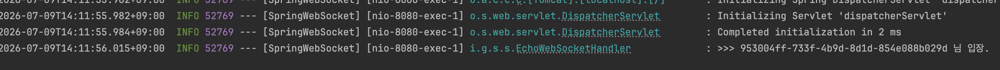
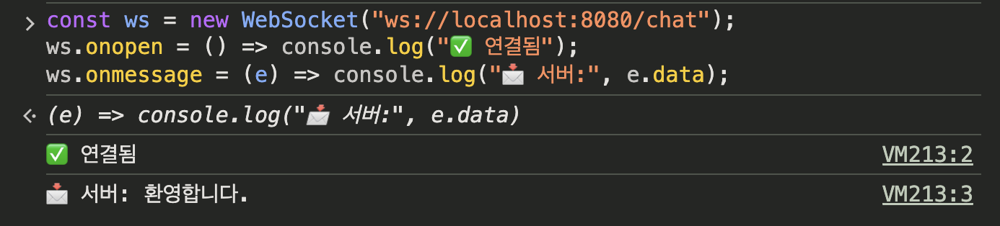

<!--more-->


## 📂 목차
- [흐름](#흐름)
- [WebSocket](#websocket)
    - [Spring WebSocketSession 만들기](#spring-websocketsession-만들기)
    - [WebSocketSession](#websocketsession)
    - [(옵션) 메시지 크기 제한](#옵션-메시지-크기-제한)
    - [Echo 구현](#echo-구현)
- [단일 서버 채팅접속자 관리](#단일-서버-채팅접속자-관리)
    - [ConcurrentWebSocketSessionDecorator 동시성 관리](#concurrentwebsocketsessiondecorator-동시성-관리)
    - [(옵션) CORS 체크](#옵션-cors-체크)
    - [(옵션) Virtual Thread 사용](#)

---

## 📚 본문

채팅 서비스를 만들어보자.

### 흐름

기본적으로 다음과 같은 데이터 흐름이 있다.

```text
클라이언트 → (요청) → 서버 → (응답) → 클라이언트 → 연결 끊김
```

이 상황에서 채팅 서비스의 문제는 서버가 먼저 말을 걸 수 없다는 것이다. 다른 사람이 메시지를 보냈을때 이를 알리려면 HTTP 로는 계속 요청을 해봐야지만 알게 된다(폴링 방식). 이는 비효율적이고 실시간도 아니다.

하지만 웹소켓은 다르다.

```text
클라이언트 ⟷ (연결 유지) ⟷ 서버
        양방향, 서버도 먼저 말 걸 수 있음
```

한 번 연결하면 끊지 않고 유지하면서, 양쪽 다 아무 때나 메시지를 보낼 수 있게 되고, 서버가 클라이언트에게 밀어줄(push) 수 있는 방식이다.

```text
[유저 A] ⟷ WebSocket ⟷ [서버] ⟷ WebSocket ⟷ [유저 B]
                          │
                    ┌─────┴─────┐
              접속자 관리    메시지 라우팅
             (누가 붙어있나)  (A→방→B에게 전달)
```

1. 유저가 접속하면 → 서버가 그 연결(WebSocket Session)을 어딘가 저장해둠
2. 유저 A가 메시지 보내면 → 서버가 같은 방의 다른 유저들 연결을 찾아서
3. 그 연결들로 메시지를 밀어줌(broadcast)

여기서는 동시성 관리가 중요한데, 여러 유저가 동시에 접속/해제하며 건드리고, 메시지 뿌릴 때 여러 연결을 동시에 써야하기 때문이다. 이는 다중 서버 문제일 때 더 부각되는데,

```text
서버 1대일 때:
[A] ⟷ [서버] ⟷ [B]     ← A, B 둘 다 같은 서버, 문제없음

서버 2대일 때:
[A] ⟷ [서버1]  ...  [서버2] ⟷ [B]
        └─ A는 서버1에, B는 서버2에 붙음
        → A가 보낸 메시지가 서버1에만 있음
        → 서버2에 붙은 B는 못 받음 ❌
```

A 와 B 에 연결된 세션은 같은 서버라서 문제가 없겠지만, 서버가 여러 대로 늘어나면 그만큼 데이터 트래픽 관리가 복잡해진다.

### WebSocket

3-Way Handshake 를 이용해서 기본적으로 연결을 유지하게 된다.

```text
연결 (핸드셰이크) → [연결 계속 유지] → 양쪽이 아무 때나 메시지 주고받음 → 명시적으로 닫을 때까지 유지
```

TCP 방식이며, 한쪽이 명시적으로 닫을 때까지 이는 유효하다. 연결을 보통 세션이라고도 한다. 여기서 재밌는 부분은 HTTP 요청을 통해서 이를 WebSocket 으로 바꾸는 과정이 포함되어 있다. 이를 `101 Switching Protocols` 을 통해서 이루어지게 되고, 그래서 WebSocket URL은 다른 프로토콜로 `ws://`, `wss://` 로 시작하게 된다.

```text
1. 클라이언트: HTTP 요청 보냄 -> 그 이후 ws 으로 승격할 수 있는 페이로드를 보냄
   GET /chat HTTP/1.1
   Upgrade: websocket          ← 이 헤더가 핵심
   Connection: Upgrade

2. 서버:
   HTTP/1.1 101 Switching Protocols   ← 101 상태코드

3. 이후: 그 연결이 WebSocket으로 전환됨 → 계속 유지
```

연결 유지의 실체는 바로 세션이다. 서버는 각 연결을 WebSocketSession 객체로 붙잡아두게 된다.

#### Spring WebSocketSession 만들기

다음 의존성을 추가한다.

```text
implementation 'org.springframework.boot:spring-boot-starter-websocket'
```

웹소켓에서는 연결의 생명주기 이벤트마다 콜백이 있고, `TextWebSocketHandler` 를 상속해서 구현한다.

```java
@Component
@Slf4j
public class EchoWebSocketHandler extends TextWebSocketHandler { }
```

`TextWebSocketHandler` 를 기억해두자. `TextWebSocketHandler` 를 까보자.

```java
public class TextWebSocketHandler extends AbstractWebSocketHandler {
    protected void handleBinaryMessage(WebSocketSession session, BinaryMessage message) {
        try {
            session.close(CloseStatus.NOT_ACCEPTABLE.withReason("Binary messages not supported"));
        } catch (IOException var4) { }
    }
}
```

`AbstractWebSocketHandler` 를 상속받아 구현중인데, `handleBinaryMessage` 를 볼 수 있다. Binary 형태의 스트링을 보내는 함수이다. 상위 함수를 보면


```java
public void afterConnectionEstablished(WebSocketSession session) throws Exception {}
public void handleMessage(WebSocketSession session, WebSocketMessage<?> message) throws Exception {
    if (message instanceof TextMessage textMessage) {
        this.handleTextMessage(session, textMessage);
    } else if (message instanceof BinaryMessage binaryMessage) {
        this.handleBinaryMessage(session, binaryMessage);
    } else {
        if (!(message instanceof PongMessage)) {
            throw new IllegalStateException("Unexpected WebSocket message type: " + String.valueOf(message));
        }

        PongMessage pongMessage = (PongMessage)message;
        this.handlePongMessage(session, pongMessage);
    }

}
protected void handleTextMessage(WebSocketSession session, TextMessage message) throws Exception {}
protected void handleBinaryMessage(WebSocketSession session, BinaryMessage message) throws Exception {}
protected void handlePongMessage(WebSocketSession session, PongMessage message) throws Exception {}
public void handleTransportError(WebSocketSession session, Throwable exception) throws Exception {}
public void afterConnectionClosed(WebSocketSession session, CloseStatus status) throws Exception {}
public boolean supportsPartialMessages() { return false; }
```

`handleMessage` 라는 함수만 주어지고, 다른 것들은 선언만 해놓고 우리가 구현해야 하는 식으로 되어 있다. 이를 Template Method Pattern 이라고 한다. 각 빈 영역의 메서드들을 채워넣으면 된다. 우선 커넥션이 성사되었을때, 커넥션을 받아서 맨 처음에 실행할 함수를 작성한다. 이는 `afterConnectionEstablished` 함수이다. 템플릿 메서드 패턴이 일종의 프로세스(라이프사이클)만 짜두고 내부 세부적인 프로세스는 알아서 우리가 구현하도록 한다.

```java
@Override
public void afterConnectionEstablished(WebSocketSession session) throws Exception {
    log.info(">>> {} 님 입장.", session.getId());
}
```

이제 log 를 이용해 서버 로그를 띄우거나 유저에게 들어왔다는 표시를 남겨줘보자. 그러기 위해서는 session 을 알아야 한다.

##### WebSocketSession

웹소켓 세션은 중요하다. 우리가 웹소켓 연결을 토대로 연결을 유지하기 위해 세션을 추상화하여 우리에게 제공해준다. 내부적인 동작 방식은 알아서 다 구현되어 있다. 우리는 연결을 가져와서 쓰기만 하면 된다.

```java
public interface WebSocketSession extends Closeable {
    String getId();
    @Nullable URI getUri();
    HttpHeaders getHandshakeHeaders();
    Map<String, Object> getAttributes();
    @Nullable Principal getPrincipal();
    @Nullable InetSocketAddress getLocalAddress();
    @Nullable InetSocketAddress getRemoteAddress();
    @Nullable String getAcceptedProtocol();
    void setTextMessageSizeLimit(int messageSizeLimit);
    int getTextMessageSizeLimit();
    void setBinaryMessageSizeLimit(int messageSizeLimit);
    int getBinaryMessageSizeLimit();
    List<WebSocketExtension> getExtensions();
    void sendMessage(WebSocketMessage<?> message) throws IOException;
    boolean isOpen();
    @Override
    void close() throws IOException;
    void close(CloseStatus status) throws IOException;
}
```

여기서 익숙하게 봤던 것은 id 와 principal 일 것이다. `Principal` 은 인증된 사용자의 메타데이터들이 저장되어 있는 곳이었다. 이를 이용해 우리는 이 연결의 주인이 누구인지 알 수 있다(Security 에서 보았다). 또한, `getRemoteAddress` 는 사용자의, 클라이언트의 주소가 되겠다. 그리고 또 다른 메타데이터들은 `Map<String, Object> getAttributes();` 을 통해서 저장할 수 있게 해놓았다. 세션에 부가 정보를 매달아두어서 닉네임과 방 이름, 접속한 방 아이디 등등을 여기 저장할 수 있다. 여기서 헷갈리는 점은 아까 말했던 연결의 주인을 식별하는 것과 닉네임은 엄연히 다르다는 것을 기억하자. 닉네임은 방마다 다를 수도 있고, 닉네임은 DB 소스 상에 정보를 저장하는 곳이다.

이제 메시지 전송으로 가보자.

```java
void sendMessage(WebSocketMessage<?> message) throws IOException;

boolean isOpen();                  // 연결이 아직 살아있나 (broadcast에서 체크하던 거)
void close();                      // 연결 닫기 (정상 종료, status 1000)
void close(CloseStatus status);    // 특정 상태로 닫기
```

sendMessage 로 WebSocketMessage 를 보내고 있다. isOpen, close 로 우리는 세션이 종료되었는지 살아있는지도 알 수 있다.

##### (옵션) 메시지 크기 제한

```java
void setTextMessageSizeLimit(int messageSizeLimit);
```

위 메서드를 통해서 메시지의 사이즈를 조정 가능하다. 너무 큰 메시지로 인한 공격/오작동을 막는 설정이다.

> 내부 WebSocket 세션은 동시 전송(concurrent sending)을 허용하지 않는다. 따라서 전송은 동기화(synchronized)되어야 한다. 즉, 하나의 Session에 여러 스레드가 동시에 sendMessage를 호출하면 안 된다는 것이다. 앞서 우리가 보았던게 이거다. 이를 우리는 Transaction 으로 해결할 수 있을 것이다. 나중에 다뤄보자.

```java
@Configuration
@EnableWebSocket
@RequiredArgsConstructor
public class WebSocketConfig implements WebSocketConfigurer {

    private final EchoWebSocketHandler echoHandler;

    @Override
    public void registerWebSocketHandlers(WebSocketHandlerRegistry registry) {
        registry.addHandler(echoHandler, "/ws/echo")
                .setAllowedOrigins("*");
    }
}
```

`/ws/echo`로 들어오는 `WebSocket` 연결을 `echoHandler` 가 처리하도록 했다. `@EnableWebSocket` 이 `WebSocket` 기능을 켜는 스위치이다.

##### Echo 구현

이제 사용자에게 환영 메시지를 보내자. 그러기 전에 또 보아야 할 것은 `WebSocketMessage` 가 어떻게 생겨먹었는지다. `sendMessage` 함수를 쓸때 우리는 `WebSocketMessage` 를 보내야 하는 것을 알 수 있었다.

```java
public interface WebSocketMessage<T> {
	T getPayload();

	int getPayloadLength();

	boolean isLast();
}
```

위처럼 생겼지만 인터페이스를 가져와서 쓸 수는 없다. `AbstractWebSocketMessage` 를 찾아보자.

```java
public abstract class AbstractWebSocketMessage<T> implements WebSocketMessage<T> {
	private final T payload;
	private final boolean last;

	AbstractWebSocketMessage(T payload) {
		this(payload, true);
	}

	AbstractWebSocketMessage(T payload, boolean isLast) {
		Assert.notNull(payload, "payload must not be null");
		this.payload = payload;
		this.last = isLast;
	}
    // ...
```

우선 payload 쪽을 보자. final 로 선언되어 있어서 한 번 쓰면 더이상 새로 생성하지 않고서야 수정할 수 없다. 텍스트 메시지라면 `String`, 바이너리 메시지라면 `ByteBuffer` 등이 이 제너릭 타입에 위치하게 된다. 생성자는 payload 를 받게 되고, isLast 변수도 있는 것을 보면 `AbstractWebSocketMessage` 단위는 문장을 한 뭉텅이가 아닌 따로따로도 보낼 수 있는 것을 알 수 있다. 우리가 대용량 메시지를 보낼때 사용하는 듯하다. 이를 나중에 써볼 것이다.

이를 상속받는 `TextWebSocketMessage` 를 보자.

```java
public final class TextMessage extends AbstractWebSocketMessage<String> {
	private final byte @Nullable [] bytes;

	public TextMessage(CharSequence payload) {
		super(payload.toString(), true);
		this.bytes = null;
	}

	public TextMessage(byte[] payload) {
		super(new String(payload, StandardCharsets.UTF_8));
		this.bytes = payload;
	}

	public TextMessage(CharSequence payload, boolean isLast) {
		super(payload.toString(), isLast);
		this.bytes = null;
	}
    // ...
}
```

String 형태의 메시지를 보낼 수 있는 최종 클래스이다. 네트워크 전송 효율과 메모리 최적화를 고려한 설계가 잘되어 있는데, 이를 보자. TextMessage 는 bytes 라는 byte 배열을 갖고 있다. 이는 소켓 네트워크 최하단(TCP/IP) 에서는 결국 모든 데이터가 바이트 배열로 전송되기 때문에, 만약 생성 시점에 `byte[]`를 미리 받아주면, 이를 버리지 않고 저장해두어서 바이트로 변환하는 중복 연산 비용을 줄이기 위한 최적화가 가능하다. 생성자는 java primitive 들로 쉽게 바꿀 수 있는 형태만 받도록 되어 있다. `String` 이 `CharSequence` 인터페이스를 구현한 클래스이기 때문에 우리는 쉽게 가져다 쓸 수 있다.

또한 `StringBuilder`, `StringBuffer` 도 `CharSequence` 이다.

```java
@Override
public void afterConnectionEstablished(WebSocketSession session) throws Exception {
    log.info(">>> {} 님 입장.", session.getId());
    session.sendMessage(intro);
}
```

이제 구성 설정만 해주고 바로 돌려보자.

```java
@Configuration
@RequiredArgsConstructor
public class WebSocketConfig implements WebSocketConfigurer {
    @Override
    public void registerWebSocketHandlers(WebSocketHandlerRegistry registry) {
        
    }
}
```

`WebSocketConfigurer` 를 구현하여서 우리가 만들었던 Session 핸들러를 여기 등록해준다.

```java
@Override
public void registerWebSocketHandlers(WebSocketHandlerRegistry registry) {
    registry.addHandler(echoWebSocketHandler, "/chat");
}
```

우리의 웹소켓 핸들러가 URL path 어디로 들어오면 세션 연결을 시킬지를 설정한다. 이것만 해주면 안되고 Spring 의 AutoConfiguration 을 켜주어야 한다. `@EnabledWebSocket` 을 Configuration 에 붙이자. 이제 웹 브라우저에서 개발자 도구를 열어서 웹소켓 연결을 시도하자.

```javascript
const ws = new WebSocket("ws://localhost:8080/chat");
```

자바스크립트로 위를 입력한다.



성공했음을 볼 수 있다. 하지만, 아직 이르다. 우리한테 메시지가 온게 없는 것을 볼 수 있다. 이는 ws 변수 안에 저장되어 있는데, javascript 의 WebSocket 안에는 `onmessage` 를 이용해 우리가 메시지가 왔는지 확인할 수 있다. onmessage 는 함수 선언문을 통해 메시지를 출력하도록 할 수 있다.

```javascript
const ws = new WebSocket("ws://localhost:8080/chat");
ws.onopen = () => console.log("✅ 연결됨");
ws.onmessage = (e) => console.log("📩 서버:", e.data);
```



이제 클라이언트 쪽에서 연결된 세션에 `send` 메서드를 이용해 보낼 수 있다. 이를 받아낼 함수`handleTextMessage`를 만들어주자.

```java
@Override
protected void handleTextMessage(WebSocketSession session,
                                    TextMessage message
) throws Exception {
    log.info(">>> {}: {}", session.getId(), message.toString());
    session.sendMessage(message);
}
```

이를 이용해 message 를 다시 메아리 보낼 수 있다.

```java
@Override
protected void handleTextMessage(WebSocketSession session,
                                    TextMessage message
) throws Exception {
    log.info(">>> {}: {}", session.getPrincipal(), message.toString());
    session.sendMessage(message);
}
```

여기서 getId 를 하지 않고, getPrincipal 을 통해서 해보자. 그러면 

```text
>>> null: TextMessage payload=[안녕하세요], byteCount=15, last=true]
```

`null` 이 뜨는 것을 알 수 있는데, 이는 아직 우리가 principal 을 설정 안해주어서이다. 초기에 연결이 될 때 이 값을 설정해주어야 한다. 이는 당연히 Security 가 한다. 그러니 Security 를 설정하여 `Authentication` 을 가진 요청만이 이 값을 null 이 아닌 값으로 들어올 수 있다. 퇴장은 다음과 같이 한다:

```java
@Override
public void afterConnectionClosed(WebSocketSession session,
                                    CloseStatus status
) throws Exception {
    log.info(">>> {} 님이 나갔습니다.", session.getId());
}
```

이제 단일 서버에서 채팅 접속자들을 관리해보자.

#### 단일 서버 채팅접속자 관리

단일 서버에서 여러 연결된 세션에게 메시지를 뿌릴 수 있는 것을 확인했다. 여기서 한 사람이 보낸 메시지를 다수의 사람에게 뿌릴 때에 접속 세션들을 모아놓은 컬렉션이 필요하다. 이를 선언해주자.

```java
private final Set<WebSocketSession> sessions = ConcurrentHashMap.newKeySet();
```

`ConcurrentHashMap` 에서는 `static` 한 메서드로 `newKeySet()` 이라는 것을 만들 수 있다. 멀티스레드 환경을 위해 `Collections.synchronizedSet(new HashSet<>())` 을 사용할 수도 있겠지만, 이는 데이터에 접근할 때마다 `Set` 전체에 락(Lock)을 걸어 한 스레드가 작업할 때 다른 모든 스레드가 대기해야 하는 병목 현상이 생기게 된다. 반면 `ConcurrentHashMap` 은 `Lock Striping` 이라는 해시 맵을 여러 조각으로 나누어 부분 락을 거는 기술을 사용한다.

이제 이를 이용해서 처음 connection 이 들어오면 이를 저장해주자. 또한, 다른 사용자들에게 메시지를 보내게 하기 위해 `broadcast` 을 구현하자.

```java
@Override
public void afterConnectionEstablished(WebSocketSession session) throws Exception {
    log.info(">>> {} 님 입장.", session.getId());
    sessions.add(session);
    broadcast(">>> " + session.getId() + " 님이 입장하였습니다.");
}

@Override
protected void handleTextMessage(WebSocketSession session,
                                    TextMessage message
) throws Exception {
    log.info(">>> {}: {}", session.getId(), message.toString());
    broadcast("["+ session.getId() +"]" + message.getPayload());
}

@Override
public void afterConnectionClosed(WebSocketSession session,
                                    CloseStatus status
) throws Exception {
    sessions.remove(session);
    log.info(">>> {} 님이 나갔습니다.", session.getId());
    broadcast(">>> " + session.getId() + " 님이 퇴장하였습니다.");
}

private void broadcast(String message) throws Exception {
    for (var session: sessions) {
        if (session.isOpen())
            session.sendMessage(new TextMessage(message));
    }
}
```

여기서 이제 문제가 발생하는 것은 사용자가 늘어감에 따라서 내부적으로 스레드가 여러 스레드가 필요하다. 접속자 목록은 이미 `ConcurrentHashMap.newKeySet` 로 해결했기 때문에 여러 스레드가 이를 조회하는 데에 문제는 없을 것이다. 다만, `broadcast` 를 할 때, 여러 스레드가 한 세션에 보낼 우려가 있다. 이를 해결하려면 처음 이 Session 을 만들때 `ConcurrentWebSocketSessionDecorator` 라는 데코레이터 패턴을 이용하여 이를 감싸주어야 한다(Concurrent 기능이 들어간 Session).

##### ConcurrentWebSocketSessionDecorator 동시성 관리

```java
WebSocketSession safeSession = new ConcurrentWebSocketSessionDecorator(
        session,
        1000,
        8192
);
```

`sendTimeLimit` 은 전송에 너무 오래 걸리면 세션을 닫는 임계치이다. 이는 느린 클라이언트가 전체를 막는 걸 방지하게 한다. `bufferSizeLimit` 은 밀린 메시지가 8192 바이트 즉, 8KB 이상이면 세션을 닫도록 설정해준다. 이는 메모리 폭발을 방지하도록 한다. 결론적으로 `ConcurrentWebSocketSessionDecorator` 여러 스레드가 동시에 `sendMessage` 를 호출해도, 내부적으로 큐에 쌓아서 순서대로 하나씩 전송하게 된다.

항상 채팅 서비스를 구축할 때에는 동시성을 고려한 클래스로 구현하자.

##### (옵션) CORS 체크

웹에서 101 Switching Protocols 으로 승격하려고 할때, 이는 cross-origin 이 된다. 기본적으로 이를 막아놓는게 Default 이기 때문에 config 에서 이를 수정해줘야 한다.

```java
@Override
public void registerWebSocketHandlers(WebSocketHandlerRegistry registry) {
    registry.addHandler(echoWebSocketHandler, "/chat")
            .setAllowedOrigins("*");
}
```

다 허용하면 안되고 배포할 때에는 제한시키자.

##### (옵션) Virtual Thread 사용

```yml
spring:
  threads:
    virtual:
      enabled: true
```

Java 21 부터는 virtual thread 를 사용할 수 있는데, 대규모 I/O 처리가 필요한 애플리케이션의 성능을 극대화할 수 있다.

```java
@Configuration
public class ExecutorConfig {
    @Bean
    public Executor websocketExecutor() {
        return Executors.newVirtualThreadPerTaskExecutor();
    }
}
```

실행 관련 컨피그를 따로 만들어주자(순환참조 문제).

```java
@Override
protected void handleTextMessage(WebSocketSession session,
                                    TextMessage message
) throws Exception {
    log.info(">>> {}: {}", session.getId(), message.toString());
    websocketExecutor.execute(() -> broadcast("[" + session.getId() + "]" + message.getPayload()));
}
```

이제 메시지를 보낼 때 virtual thread 를 이용해 작업을 수행하도록 바꿔만 주면 끝이다. 자세한 코드는 아래를 살펴보기를 바란다.


[Spring WebSocket](https://github.com/seonghun120614/Spring-WebSocket)